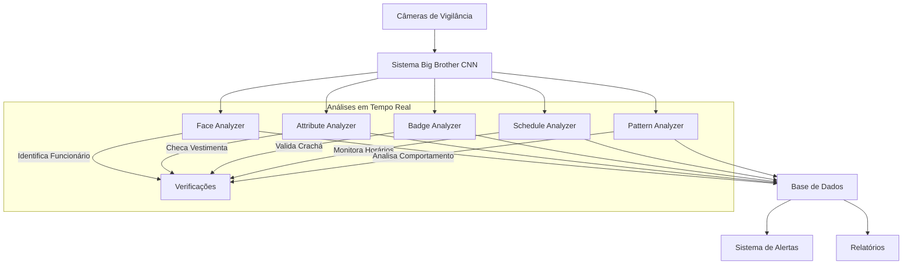

# Arquitetura do Sistema Big Brother CNN

## Visão Geral

O Big Brother CNN é um sistema modular de vigilância corporativa que utiliza redes neurais convolucionais (CNNs) e processamento de imagem em tempo real para monitoramento e análise de conformidade.



## Componentes do Sistema

### 1. Sistema de Captura
- **Entrada**: Streams de vídeo das câmeras de vigilância
- **Processamento**: Captura de frames em tempo real
- **Saída**: Frames processados para análise

### 2. Analyzers Especializados

#### 2.1 Face Analyzer
- **Tecnologias**: CASIA-WebFace, VGG Face2
- **Função**: Reconhecimento e identificação facial
- **Processo**:
  - Detecção facial em frames
  - Extração de características
  - Comparação com banco de faces autorizado

#### 2.2 Attribute Analyzer
- **Dataset**: WIDER Attribute Dataset
- **Função**: Análise de conformidade visual
- **Atributos**:
  - Vestimentas apropriadas
  - EPIs necessários
  - Acessórios permitidos/proibidos

#### 2.3 Badge Analyzer
- **Tecnologias**: CNN + OCR (Tesseract/EasyOCR)
- **Função**: Validação de crachás
- **Processo**:
  - Detecção do crachá
  - Leitura OCR
  - Validação das informações

#### 2.4 Schedule Analyzer
- **Dados**: horarios.csv, rotinas.json
- **Função**: Monitoramento temporal
- **Verificações**:
  - Horários de entrada/saída
  - Permanência em áreas
  - Padrões de movimento

#### 2.5 Pattern Analyzer
- **Armazenamento**: SQLite
- **Função**: Análise comportamental
- **Detecções**:
  - Desvios de rotina
  - Comportamentos suspeitos
  - Padrões anormais

### 3. Sistema de Integração

#### 3.1 Processamento Central
```python
class IntegratedAnalysisSystem:
    def process_frame(self, frame):
        # Análise paralela
        face_results = self.face_analyzer.analyze(frame)
        attribute_results = self.attribute_analyzer.analyze(frame)
        badge_results = self.badge_analyzer.analyze(frame)
        schedule_results = self.schedule_analyzer.check_time()
        pattern_results = self.pattern_analyzer.analyze_behavior()

        # Integração de resultados
        return IntegratedResults(
            face_results,
            attribute_results,
            badge_results,
            schedule_results,
            pattern_results
        )
```

#### 3.2 Sistema de Alertas
- **Níveis**: Informativo, Atenção, Crítico
- **Canais**: Email, SMS, Dashboard
- **Triggers**:
  - Acesso não autorizado
  - Ausência de crachá
  - Violação de dress code
  - Desvios de horário
  - Comportamentos suspeitos

#### 3.3 Geração de Relatórios
- **Tipos**: Diário, Semanal, Mensal
- **Conteúdo**:
  - Métricas de conformidade
  - Histórico de ocorrências
  - Análises estatísticas
  - Tendências comportamentais

## Fluxo de Dados

1. **Captura** → Frames de vídeo em tempo real
2. **Processamento** → Análise paralela pelos analyzers
3. **Integração** → Combinação de resultados
4. **Decisão** → Geração de alertas se necessário
5. **Armazenamento** → Registro em banco de dados
6. **Relatório** → Geração de análises e estatísticas

## Segurança e Privacidade

### 1. Proteção de Dados
- Criptografia de dados biométricos
- Anonimização de logs
- Controle de acesso granular

### 2. Conformidade
- LGPD (Brasil)
- GDPR (Europa)
- Políticas corporativas

### 3. Auditoria
- Logs de todas operações
- Rastreamento de acessos
- Histórico de alterações

## Requisitos Técnicos

### 1. Hardware
- GPU compatível com CUDA
- Armazenamento SSD
- Câmeras HD/4K

### 2. Software
- Python 3.8+
- PyTorch
- OpenCV
- Tesseract OCR 4.0+

## Escalabilidade

O sistema foi projetado para escalar horizontalmente:

1. **Processamento Distribuído**
   - Múltiplos nós de processamento
   - Balanceamento de carga
   - Cache distribuído

2. **Armazenamento**
   - Sharding de banco de dados
   - Rotação de logs
   - Compressão de dados históricos

3. **Análise**
   - Processamento em batch
   - Análise assíncrona
   - Filas de prioridade

## Manutenção e Monitoramento

### 1. Healthchecks
- Status dos analyzers
- Latência de processamento
- Uso de recursos

### 2. Backup
- Dados biométricos
- Histórico de análises
- Configurações do sistema

### 3. Atualizações
- Modelos de ML
- Regras de negócio
- Parâmetros de conformidade 