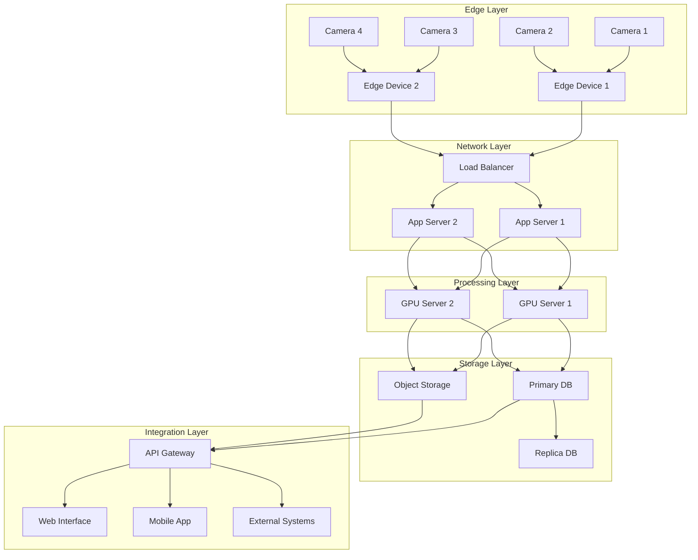
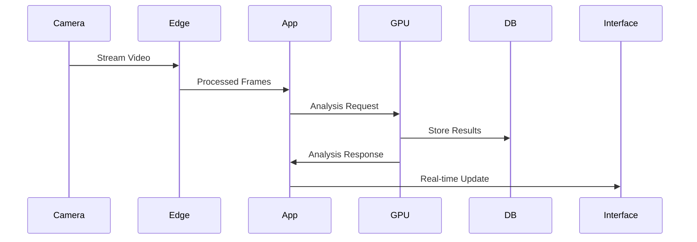
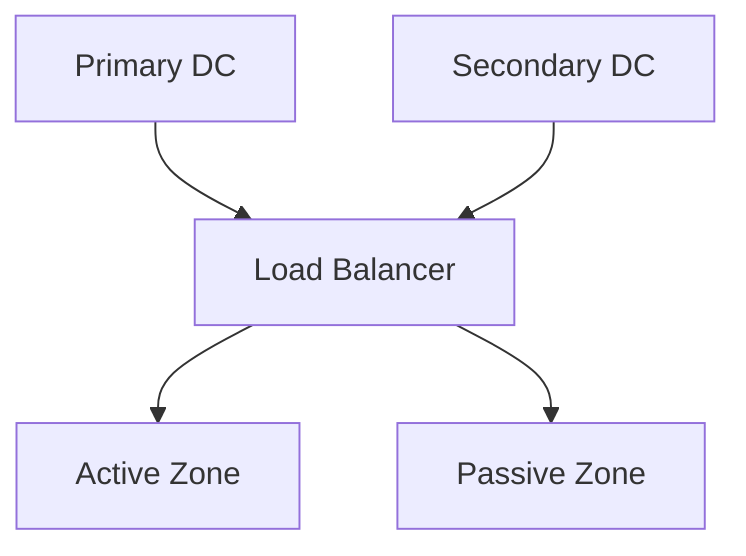

# Diagrama de Deployment

## 1. Visão Geral da Infraestrutura

## 2. Componentes

### 2.1 Edge Layer
- **Câmeras**
  - Resolução: 4K
  - FPS: 30-60
  - Protocolo: RTSP
  
- **Edge Devices**
  - Hardware: NVIDIA Jetson
  - OS: Linux
  - Storage: 256GB SSD

### 2.2 Network Layer
- **Load Balancer**
  - Software: NGINX
  - Algoritmo: Round Robin
  - SSL Termination
  
- **App Servers**
  - Hardware: 16 Core CPU
  - RAM: 32GB
  - OS: Ubuntu Server

### 2.3 Processing Layer
- **GPU Servers**
  - GPU: NVIDIA A100
  - VRAM: 40GB
  - CUDA: 11.x
  
### 2.4 Storage Layer
- **Database**
  - Primary: PostgreSQL
  - Replica: Hot Standby
  - Backup: Daily
  
- **Object Storage**
  - S3 Compatible
  - Lifecycle Rules
  - Encryption

### 2.5 Integration Layer
- **API Gateway**
  - REST APIs
  - WebSocket
  - Authentication
  
- **Interfaces**
  - Web: React
  - Mobile: React Native
  - External: REST/GraphQL

## 3. Especificações Técnicas

### 3.1 Hardware Requirements

| Component | CPU | RAM | Storage | Network |
|-----------|-----|-----|---------|---------|
| Edge Device | 4 cores | 8GB | 256GB SSD | 1Gbps |
| App Server | 16 cores | 32GB | 512GB SSD | 10Gbps |
| GPU Server | 32 cores | 128GB | 2TB NVMe | 40Gbps |
| Database | 16 cores | 64GB | 4TB SSD | 10Gbps |

### 3.2 Software Stack

| Layer | Technology |
|-------|------------|
| OS | Ubuntu 20.04 LTS |
| Container | Docker + Kubernetes |
| Database | PostgreSQL 13 |
| Cache | Redis 6 |
| Message Queue | RabbitMQ |
| Monitoring | Prometheus + Grafana |

## 4. Fluxo de Dados

## 5. Escalabilidade

### 5.1 Horizontal Scaling
- Auto-scaling groups
- Container orchestration
- Database sharding
- Load balancing

### 5.2 Vertical Scaling
- CPU upgrade path
- RAM expansion
- Storage increase
- Network capacity

## 6. Alta Disponibilidade

### 6.1 Redundância

### 6.2 Failover
- Automatic failover
- Data replication
- Session persistence
- Health monitoring

## 7. Segurança

### 7.1 Network Security
- Firewall rules
- VPN access
- VLAN isolation
- IDS/IPS

### 7.2 Data Security
- Encryption at rest
- Encryption in transit
- Access control
- Audit logging

## 8. Monitoramento

### 8.1 Metrics
- System health
- Performance
- Resource usage
- Error rates

### 8.2 Alerting
- Threshold alerts
- Anomaly detection
- Incident response
- Escalation paths

## 9. Disaster Recovery

### 9.1 Backup Strategy
- Full daily backup
- Incremental hourly
- Point-in-time recovery
- Geo-replication

### 9.2 Recovery Process
1. Failover trigger
2. DNS update
3. Data sync
4. Service restore

## 10. Compliance

### 10.1 Data Protection
- LGPD compliance
- GDPR requirements
- Data retention
- Access controls

### 10.2 Audit
- System logs
- Access logs
- Change tracking
- Compliance reports 