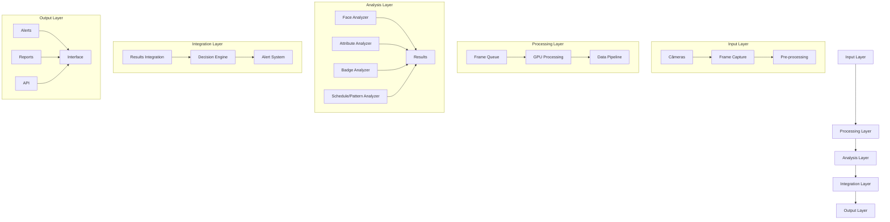
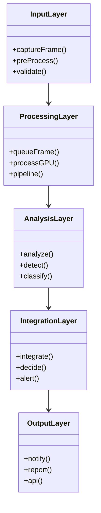
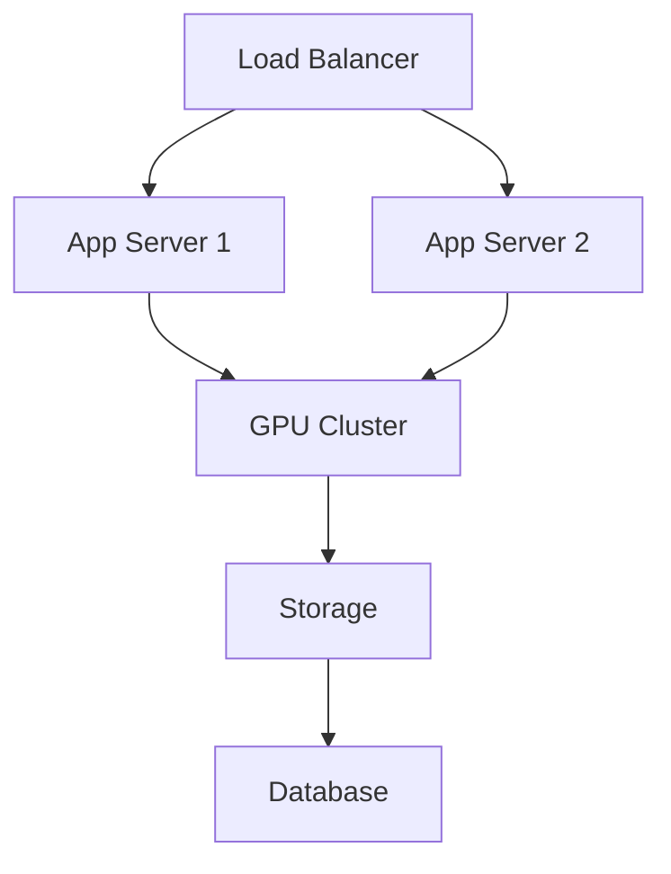
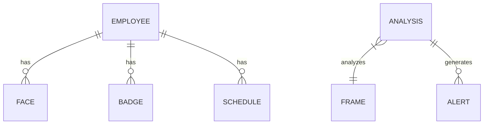

# Software Architecture Document (SAD)

## 1. Introdução

### 1.1 Propósito
Este documento apresenta a arquitetura de software do sistema Big Brother CNN, descrevendo seus componentes principais, interações e decisões arquiteturais.

### 1.2 Escopo
- Sistema de vigilância corporativa
- Análise em tempo real
- Processamento de vídeo
- Machine Learning/Deep Learning
- Geração de alertas

## 2. Visão Arquitetural

### 2.1 Representação Arquitetural



### 2.2 Visão de Casos de Uso

#### Principais Casos de Uso
1. Monitoramento em tempo real
2. Detecção de violações
3. Geração de alertas
4. Análise de conformidade
5. Geração de relatórios

## 3. Metas e Restrições Arquiteturais

### 3.1 Metas
- Alta disponibilidade (99.9%)
- Baixa latência (< 200ms)
- Escalabilidade horizontal
- Segurança e privacidade
- Manutenibilidade

### 3.2 Restrições
- Compliance LGPD/GDPR
- Recursos computacionais
- Limitações de rede
- Requisitos de storage
- Compatibilidade

## 4. Visão Lógica

### 4.1 Visão Geral
O sistema é dividido em cinco camadas principais:
1. Entrada de dados
2. Processamento
3. Análise
4. Integração
5. Saída

### 4.2 Pacotes de Design Significativos



## 5. Visão de Processo

### 5.1 Processos Principais
1. Captura de frames
2. Pré-processamento
3. Análise
4. Integração
5. Alertas

### 5.2 Comunicação entre Processos
- Message queues
- Event-driven
- REST APIs
- WebSockets

## 6. Visão de Implantação

### 6.1 Topologia



### 6.2 Servidores
- Application servers
- GPU servers
- Database servers
- Storage servers
- Monitoring servers

## 7. Visão de Implementação

### 7.1 Camadas
1. **Presentation Layer**
   - Web Interface
   - Mobile App
   - API Gateway

2. **Business Layer**
   - Analyzers
   - Integration
   - Business Rules

3. **Data Layer**
   - Database
   - File Storage
   - Cache

### 7.2 Framework

```python
class BaseAnalyzer:
    def analyze(self, frame):
        pass

class FaceAnalyzer(BaseAnalyzer):
    def analyze(self, frame):
        # Face detection and recognition
        pass

class AttributeAnalyzer(BaseAnalyzer):
    def analyze(self, frame):
        # Attribute analysis
        pass

class IntegrationSystem:
    def __init__(self, analyzers):
        self.analyzers = analyzers

    def process(self, frame):
        results = []
        for analyzer in self.analyzers:
            results.append(analyzer.analyze(frame))
        return self.integrate_results(results)
```

## 8. Visão de Dados

### 8.1 Modelo de Dados



### 8.2 Persistência
- SQLite para dados estruturados
- File system para imagens
- Redis para cache
- Time series DB para métricas

## 9. Tamanho e Performance

### 9.1 Objetivos de Performance
- Latência < 200ms
- Throughput > 30 FPS
- CPU usage < 80%
- GPU usage < 90%
- Memory usage < 85%

### 9.2 Estratégias
1. Caching
2. Load balancing
3. GPU optimization
4. Data compression
5. Connection pooling

## 10. Qualidade

### 10.1 Atributos de Qualidade
- Disponibilidade
- Performance
- Segurança
- Manutenibilidade
- Escalabilidade

### 10.2 Táticas Arquiteturais
1. **Disponibilidade**
   - Redundância
   - Failover
   - Health check

2. **Performance**
   - Caching
   - Load balancing
   - Otimização

3. **Segurança**
   - Encryption
   - Authentication
   - Authorization

4. **Manutenibilidade**
   - Modularização
   - Clean code
   - Documentação

5. **Escalabilidade**
   - Horizontal scaling
   - Microservices
   - Containerization 