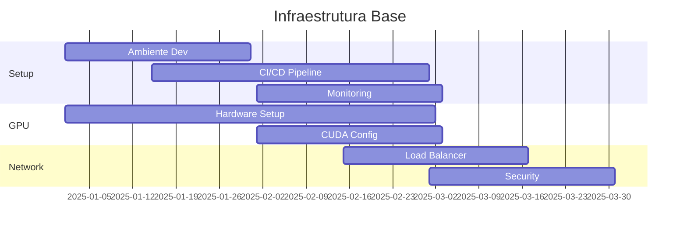
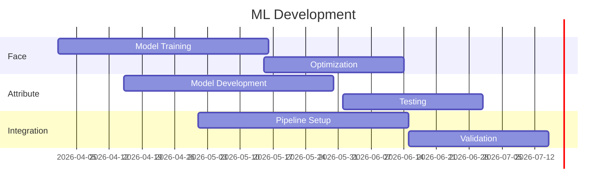
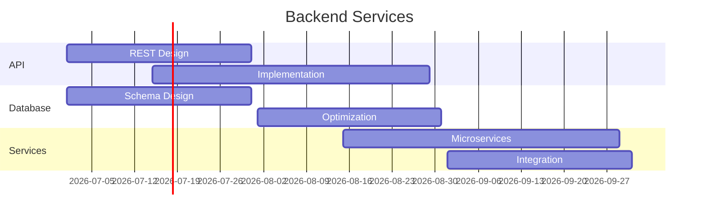
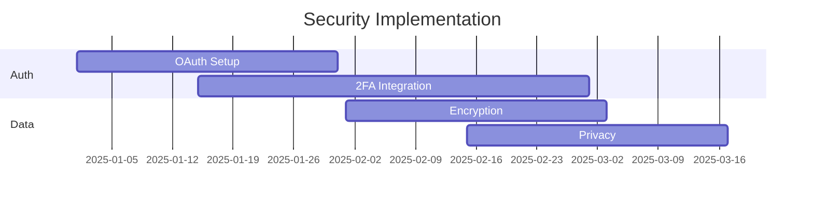
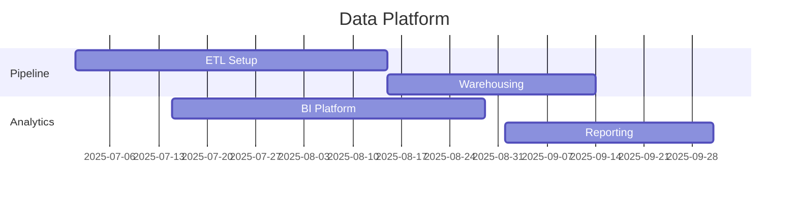
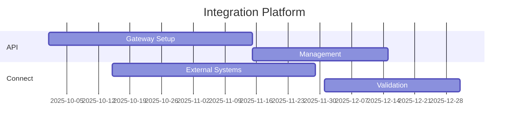
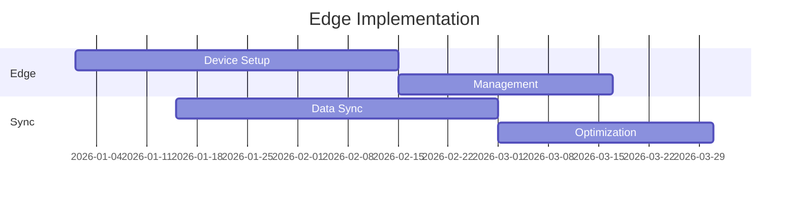

# Roadmap Técnico

## 1. Infraestrutura (2025 Q1-Q2)

### Q1: Fundação

### Q2: Otimização
- GPU Clustering
- Load Balancing
- Auto-scaling
- Performance tuning
- Security hardening

## 2. Machine Learning (2026 Q2-Q3)

### Q2: Core Models

### Q3: Advanced Features
- Transfer Learning
- Model Optimization
- AutoML Pipeline
- Validation Framework
- Performance Metrics

## 3. Backend Development (2026 Q3-Q4)

### Q3: Core Services

### Q4: Advanced Features
- GraphQL API
- Event Sourcing
- CQRS Pattern
- Cache Strategy
- Service Mesh

## 4. Frontend Development (2026 Q4 - 2025 Q1)

### Q4: Core UI

### Q1: Advanced Features
- PWA Support
- Offline Mode
- Real-time Charts
- Custom Widgets
- Mobile Support

## 5. Security Implementation (2025 Q1-Q2)

### Q1: Core Security

### Q2: Advanced Security
- Zero Trust
- Audit System
- Threat Detection
- DLP Solution
- Security Automation

## 6. DevOps & SRE (2025 Q2-Q3)

### Q2: Infrastructure as Code

### Q3: Advanced Ops
- Chaos Engineering
- SLO/SLI Framework
- Cost Optimization
- Capacity Planning
- Disaster Recovery

## 7. Data Platform (2025 Q3-Q4)

### Q3: Data Foundation

### Q4: Advanced Analytics
- Real-time Analytics
- Predictive Models
- Data Lake
- ML Pipeline
- Custom Dashboards

## 8. Integration & APIs (2025 Q4 - 2026 Q1)

### Q4: Core Integration

### Q1: Advanced Integration
- API Marketplace
- Integration Hub
- Event Mesh
- Custom Connectors
- API Analytics

## 9. Edge Computing (2026 Q1-Q2)

### Q1: Edge Foundation

### Q2: Advanced Edge
- 5G Integration
- Edge ML
- Local Processing
- Mesh Network
- IoT Platform

## 10. Future Tech (2026 Q2)

### Research & Development

### Innovation
- Quantum Ready
- AR/VR Support
- Blockchain
- Advanced AI
- Green Computing

## Dependências Técnicas

### Infraestrutura
- GPU Hardware
- Network Capacity
- Storage Systems
- Security Appliances

### Software
- ML Frameworks
- Cloud Services
- Development Tools
- Security Solutions

### Expertise
- ML Engineers
- DevOps Team
- Security Experts
- Data Scientists

## Riscos Técnicos

### Performance
- ML Model Accuracy
- System Latency
- Resource Usage
- Scalability

### Segurança
- Data Privacy
- Attack Vectors
- Compliance
- Access Control

### Integração
- System Complexity
- Data Consistency
- API Management
- Service Dependencies

## Mitigação

### Estratégias
- POC Development
- Gradual Rollout
- Automated Testing
- Performance Monitoring

### Contingência
- Fallback Systems
- Backup Solutions
- Alternative Paths
- Support Plans 