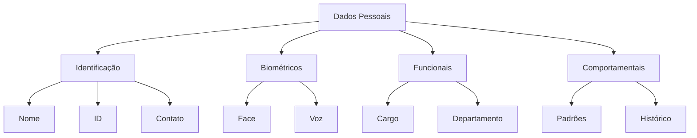
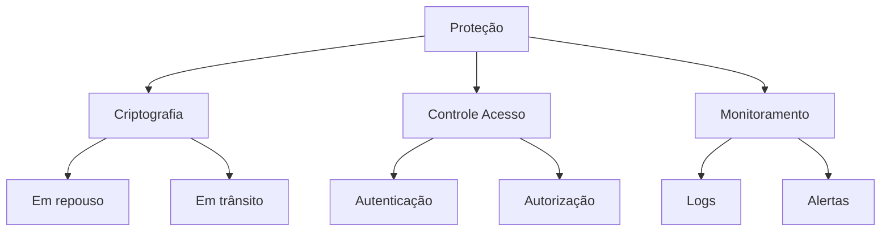
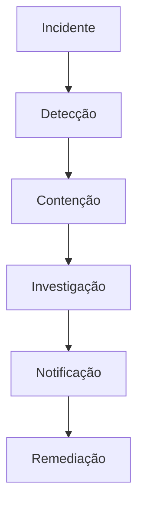

# Documento de Conformidade LGPD

## 1. Introdução

### 1.1 Objetivo
Este documento detalha as medidas implementadas para garantir a conformidade do sistema Big Brother CNN com a Lei Geral de Proteção de Dados (LGPD).

### 1.2 Escopo
- Dados pessoais processados
- Bases legais
- Direitos dos titulares
- Medidas técnicas
- Medidas organizacionais

## 2. Mapeamento de Dados

### 2.1 Categorias de Dados


### 2.2 Finalidades
```json
{
    "finalidades": {
        "controle_acesso": {
            "base_legal": "legítimo_interesse",
            "necessidade": "segurança_corporativa",
            "retenção": "vigência_contrato"
        },
        "monitoramento": {
            "base_legal": "legítimo_interesse",
            "necessidade": "segurança_patrimonial",
            "retenção": "90_dias"
        },
        "análise_comportamental": {
            "base_legal": "consentimento",
            "necessidade": "compliance_interno",
            "retenção": "1_ano"
        }
    }
}
```

## 3. Bases Legais

### 3.1 Mapeamento
| Processo | Base Legal | Justificativa |
|----------|------------|---------------|
| Face Recognition | Legítimo Interesse | Segurança |
| Dress Code | Legítimo Interesse | Compliance |
| Behavior Analysis | Consentimento | Opcional |
| Schedule Track | Contrato | Obrigatório |

### 3.2 Documentação
```python
class LegalBasis:
    def __init__(self):
        self.bases = {
            "legitimo_interesse": {
                "justificativa": "doc",
                "avaliacao_impacto": "doc",
                "medidas_protecao": "doc"
            },
            "consentimento": {
                "coleta": "form",
                "revogacao": "opt_out",
                "registro": "log"
            },
            "contrato": {
                "clausulas": "doc",
                "necessidade": "justification",
                "limitacao": "scope"
            }
        }
```

## 4. Direitos dos Titulares

### 4.1 Implementação
```python
class TitularDireitos:
    def __init__(self):
        self.direitos = {
            "acesso": self.fornecer_dados,
            "correcao": self.corrigir_dados,
            "exclusao": self.deletar_dados,
            "portabilidade": self.exportar_dados,
            "revogacao": self.revogar_consentimento
        }
    
    def fornecer_dados(self, titular_id):
        dados = self.coletar_dados(titular_id)
        return self.format_dados(dados)
```

### 4.2 Processos
1. Solicitação
2. Verificação
3. Processamento
4. Resposta
5. Registro

## 5. Medidas Técnicas

### 5.1 Segurança


### 5.2 Privacidade
```yaml
privacy_measures:
  data_minimization:
    - collect_only_necessary
    - automatic_deletion
    - anonymization
  
  access_control:
    - role_based
    - need_to_know
    - audit_trail
  
  encryption:
    - aes_256
    - key_rotation
    - secure_storage
```

## 6. Processos Organizacionais

### 6.1 Governança
- DPO designado
- Políticas documentadas
- Treinamentos
- Auditorias
- Incidentes

### 6.2 Documentação
```json
{
    "documentos": {
        "politicas": {
            "privacidade": "doc",
            "seguranca": "doc",
            "retencao": "doc"
        },
        "procedimentos": {
            "direitos_titular": "doc",
            "incidentes": "doc",
            "transferencia": "doc"
        },
        "registros": {
            "consentimento": "log",
            "acesso": "log",
            "incidentes": "log"
        }
    }
}
```

## 7. Gestão de Riscos

### 7.1 Avaliação
```python
class RiskAssessment:
    def __init__(self):
        self.risk_matrix = {
            "vazamento": {
                "probabilidade": "alta",
                "impacto": "alto",
                "controles": [
                    "encryption",
                    "access_control",
                    "monitoring"
                ]
            },
            "uso_indevido": {
                "probabilidade": "media",
                "impacto": "alto",
                "controles": [
                    "policies",
                    "training",
                    "audit"
                ]
            }
        }
```

### 7.2 Controles
- Preventivos
- Detectivos
- Corretivos
- Compensatórios

## 8. Incidentes

### 8.1 Resposta


### 8.2 Comunicação
- ANPD
- Titulares
- DPO
- Gestão
- Técnico

## 9. Transferência Internacional

### 9.1 Requisitos
```yaml
international_transfer:
  requirements:
    - adequacy_decision
    - standard_contractual_clauses
    - binding_corporate_rules
  
  safeguards:
    - encryption
    - access_control
    - audit_trail
    - data_minimization
```

### 9.2 Controles
- Contratos
- Cláusulas
- Auditorias
- Relatórios

## 10. Monitoramento

### 10.1 Métricas
```json
{
    "metricas": {
        "direitos_titular": {
            "tempo_resposta": "SLA",
            "solicitacoes": "quantidade",
            "conformidade": "percentual"
        },
        "incidentes": {
            "quantidade": "numero",
            "tempo_resposta": "horas",
            "impacto": "classificacao"
        },
        "treinamento": {
            "cobertura": "percentual",
            "efetividade": "score",
            "atualizacao": "status"
        }
    }
}
```

### 10.2 Auditorias
- Internas
- Externas
- Períodicas
- Por demanda
- Follow-up 