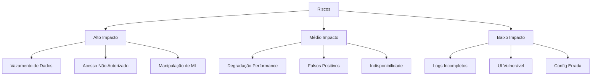
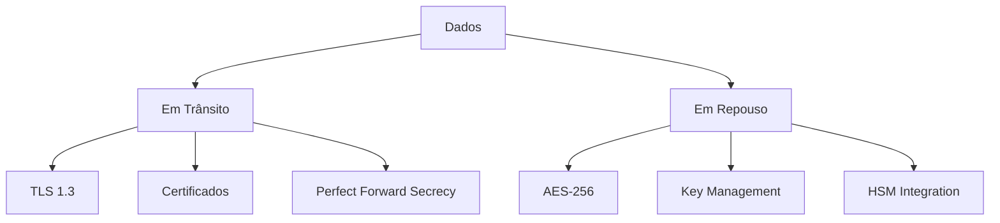
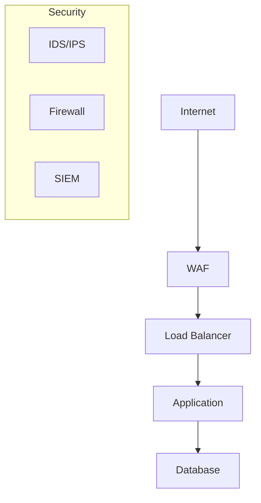
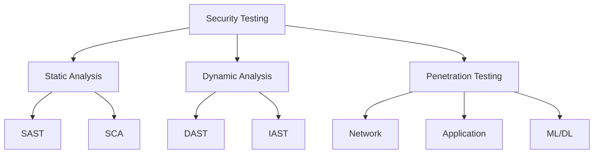

# Security Assessment

## 1. Visão Geral

### 1.1 Objetivo
Avaliar e documentar a postura de segurança do sistema Big Brother CNN, identificando riscos e definindo controles.

### 1.2 Escopo
- Segurança da aplicação
- Segurança de dados
- Segurança de infraestrutura
- Compliance
- Monitoramento

## 2. Análise de Riscos

### 2.1 Matriz de Riscos


### 2.2 Classificação
| Risco | Probabilidade | Impacto | Nível |
|-------|--------------|---------|-------|
| Vazamento | Média | Alto | Crítico |
| Acesso | Alta | Alto | Crítico |
| ML Hack | Baixa | Alto | Alto |
| Performance | Alta | Médio | Alto |
| Falsos + | Média | Médio | Médio |
| Downtime | Baixa | Médio | Médio |

## 3. Controles de Segurança

### 3.1 Autenticação
```python
class SecurityConfig:
    auth_config = {
        "2fa": {
            "required": True,
            "methods": ["totp", "sms"],
            "grace_period": 0
        },
        "password_policy": {
            "min_length": 12,
            "complexity": True,
            "history": 5,
            "max_age": 90
        },
        "session": {
            "timeout": 30,
            "max_concurrent": 1,
            "ip_binding": True
        }
    }
```

### 3.2 Autorização
```json
{
    "roles": {
        "admin": {
            "permissions": ["*"],
            "restrictions": ["audit_logs"]
        },
        "operator": {
            "permissions": [
                "view_cameras",
                "view_alerts",
                "acknowledge_alerts"
            ],
            "restrictions": [
                "config_change",
                "user_manage"
            ]
        },
        "auditor": {
            "permissions": [
                "view_logs",
                "export_reports"
            ],
            "restrictions": [
                "system_config",
                "alert_manage"
            ]
        }
    }
}
```

## 4. Proteção de Dados

### 4.1 Criptografia


### 4.2 Dados Sensíveis
- Biometria facial
- Credenciais
- Dados pessoais
- Logs de acesso
- Configurações

## 5. Segurança de ML/DL

### 5.1 Modelo de Ameaças
```python
class MLSecurity:
    threats = {
        "poisoning": {
            "type": "training_time",
            "controls": [
                "data_validation",
                "anomaly_detection",
                "model_versioning"
            ]
        },
        "evasion": {
            "type": "inference_time",
            "controls": [
                "input_sanitization",
                "adversarial_training",
                "confidence_thresholds"
            ]
        },
        "extraction": {
            "type": "model_theft",
            "controls": [
                "rate_limiting",
                "query_monitoring",
                "model_encryption"
            ]
        }
    }
```

### 5.2 Proteções
- Input validation
- Model hardening
- Output verification
- Monitoring
- Versioning

## 6. Infraestrutura

### 6.1 Network Security


### 6.2 Segmentação
- DMZ
- App layer
- Data layer
- Admin network
- Monitoring

## 7. Monitoramento

### 7.1 Security Events
```json
{
    "monitoring": {
        "siem": {
            "sources": [
                "app_logs",
                "system_logs",
                "network_logs",
                "auth_logs"
            ],
            "alerts": {
                "brute_force": {
                    "threshold": 5,
                    "window": "5m"
                },
                "data_exfil": {
                    "threshold": "100MB",
                    "window": "1h"
                }
            }
        }
    }
}
```

### 7.2 Alertas
- Security incidents
- Policy violations
- System anomalies
- Access patterns
- Data breaches

## 8. Compliance

### 8.1 LGPD/GDPR
- Consentimento
- Direitos do titular
- Retenção de dados
- Anonimização
- Auditoria

### 8.2 Controles
```python
class ComplianceControls:
    def __init__(self):
        self.controls = {
            "data_privacy": {
                "consent_management",
                "data_classification",
                "access_logging",
                "retention_policy",
                "export_capability"
            },
            "security": {
                "encryption",
                "access_control",
                "audit_logging",
                "incident_response",
                "vulnerability_management"
            }
        }
```

## 9. Incident Response

### 9.1 Playbooks
```yaml
incident_response:
  data_breach:
    steps:
      - contain:
          - isolate_systems
          - block_access
          - preserve_evidence
      - investigate:
          - collect_logs
          - analyze_scope
          - identify_vector
      - remediate:
          - patch_vulnerabilities
          - update_credentials
          - enhance_monitoring
      - report:
          - notify_stakeholders
          - document_incident
          - update_procedures
```

### 9.2 Comunicação
- Stakeholders
- Autoridades
- Usuários afetados
- Time técnico
- Gestão

## 10. Testes de Segurança

### 10.1 Metodologia


### 10.2 Ferramentas
- SonarQube
- OWASP ZAP
- Snyk
- Metasploit
- Custom ML tests

## 11. Melhoria Contínua

### 11.1 Métricas
- Vulnerabilidades
- Tempo de resposta
- Coverage
- False positives
- Incidents

### 11.2 Processo
1. Assess
2. Plan
3. Implement
4. Verify
5. Monitor 