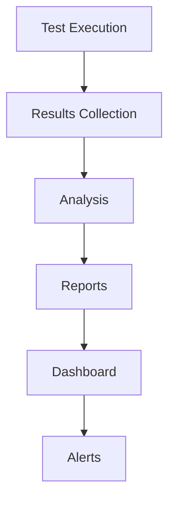
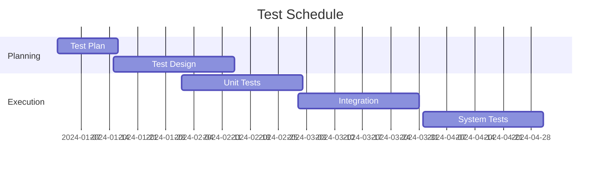

# Plano de Testes

## 1. Introdução

### 1.1 Objetivo
Este documento define a estratégia e os procedimentos de teste para o sistema Big Brother CNN, garantindo qualidade e confiabilidade.

### 1.2 Escopo
- Testes unitários
- Testes de integração
- Testes de sistema
- Testes de performance
- Testes de segurança

## 2. Estratégia de Testes

### 2.1 Níveis de Teste

#### Unitário
```python
# Exemplo de teste unitário
def test_face_detection():
    analyzer = FaceAnalyzer()
    image = load_test_image()
    result = analyzer.detect_faces(image)
    assert len(result) > 0
    assert result[0].confidence > 0.95
```

#### Integração
```python
# Exemplo de teste de integração
def test_analyzer_pipeline():
    pipeline = AnalysisPipeline()
    frame = load_test_frame()
    results = pipeline.process(frame)
    assert results.face is not None
    assert results.attributes is not None
    assert results.badge is not None
```

#### Sistema
```python
# Exemplo de teste de sistema
def test_end_to_end():
    system = IntegratedSystem()
    input_stream = MockVideoStream()
    alerts = system.process_stream(input_stream)
    assert alerts.response_time < 200  # ms
    assert alerts.accuracy > 0.9
```

### 2.2 Tipos de Teste

#### Funcional
- Feature testing
- Regression testing
- Boundary testing
- Error handling

#### Não-Funcional
- Performance
- Scalability
- Security
- Usability

## 3. Ambiente de Testes

### 3.1 Hardware
- GPU: NVIDIA T4
- CPU: 16 cores
- RAM: 64GB
- Storage: 1TB SSD

### 3.2 Software
- OS: Ubuntu 20.04
- Python 3.8+
- PyTest
- Docker
- Kubernetes

## 4. Casos de Teste

### 4.1 Face Analyzer

#### TC001 - Detecção Facial
- **Objetivo**: Verificar detecção de faces
- **Input**: Imagem com faces
- **Steps**:
  1. Carregar imagem
  2. Processar com analyzer
  3. Verificar resultados
- **Expected**: Faces detectadas com confiança > 95%

#### TC002 - Reconhecimento
- **Objetivo**: Verificar reconhecimento
- **Input**: Face conhecida
- **Steps**:
  1. Carregar face
  2. Comparar com database
  3. Verificar match
- **Expected**: Match correto com confiança > 90%

### 4.2 Attribute Analyzer

#### TC003 - Dress Code
- **Objetivo**: Verificar conformidade
- **Input**: Imagem de pessoa
- **Steps**:
  1. Analisar vestimenta
  2. Verificar regras
  3. Gerar resultado
- **Expected**: Classificação correta > 90%

#### TC004 - EPI Detection
- **Objetivo**: Detectar equipamentos
- **Input**: Imagem com EPIs
- **Steps**:
  1. Identificar EPIs
  2. Validar requisitos
  3. Gerar alerta
- **Expected**: Detecção correta > 95%

## 5. Automação

### 5.1 Framework
```python
class TestAutomation:
    def setup(self):
        self.system = TestSystem()
        self.data = TestData()
        
    def test_pipeline(self):
        for case in self.data.test_cases:
            result = self.system.run(case)
            self.validate(result, case.expected)
            
    def validate(self, result, expected):
        assert result.accuracy >= expected.accuracy
        assert result.latency <= expected.latency
```

### 5.2 CI/CD Integration
```yaml
test:
  stage: test
  script:
    - pytest tests/
    - pytest --cov=src
    - pylint src/
  artifacts:
    reports:
      coverage: coverage.xml
      junit: test-results.xml
```

## 6. Métricas

### 6.1 Cobertura
- Código: > 80%
- Funcionalidades: 100%
- Caminhos: > 90%
- Branches: > 85%

### 6.2 Performance
- Latência: < 200ms
- Throughput: > 30 FPS
- CPU: < 80%
- GPU: < 90%

## 7. Relatórios

### 7.1 Test Results
```json
{
    "summary": {
        "total": 100,
        "passed": 95,
        "failed": 5,
        "coverage": 85.5
    },
    "details": {
        "face_analyzer": {
            "accuracy": 96.5,
            "latency": 45.2
        },
        "attribute_analyzer": {
            "accuracy": 92.3,
            "latency": 38.7
        }
    }
}
```

### 7.2 Dashboards


## 8. Critérios de Aceite

### 8.1 Funcionais
- Todos testes passando
- Cobertura mínima
- Zero bugs críticos
- Documentação completa

### 8.2 Performance
- Latência máxima
- Throughput mínimo
- Resource usage
- Error rate

## 9. Responsabilidades

### 9.1 Time
- Test Lead
- Test Engineers
- Developers
- DevOps
- QA

### 9.2 Processos
1. Test Planning
2. Test Design
3. Test Execution
4. Reporting
5. Review

## 10. Cronograma

### 10.1 Fases


### 10.2 Milestones
1. Test Plan Approval
2. Test Environment Ready
3. Test Execution Complete
4. Results Accepted
5. Release Approved 