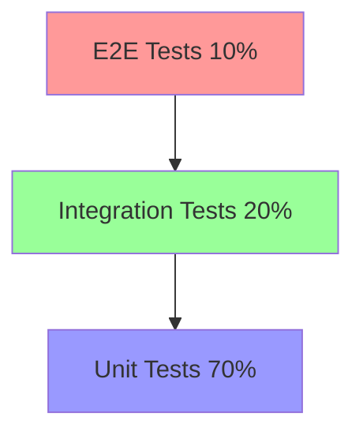
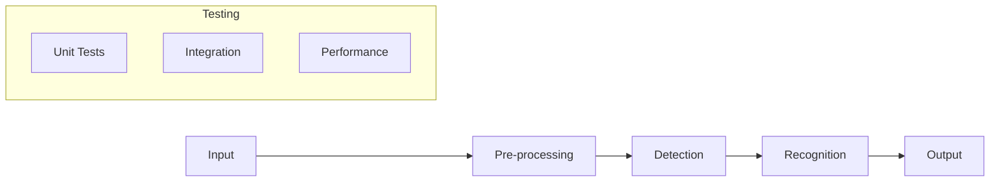
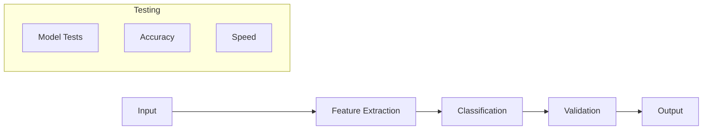
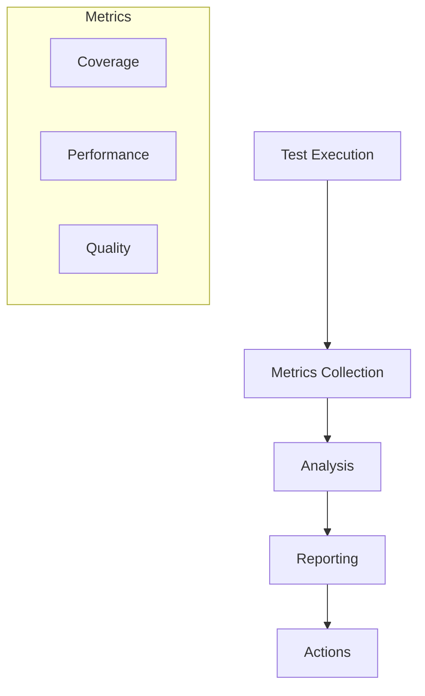
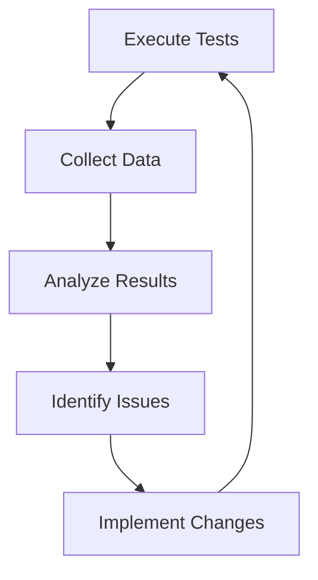

# Estratégia de Testes

## 1. Visão Geral

### 1.1 Objetivo
Definir a abordagem estratégica para garantir a qualidade do sistema Big Brother CNN através de testes abrangentes e eficazes.

### 1.2 Princípios
- Shift-left testing
- Automação primeiro
- Cobertura completa
- Feedback rápido
- Qualidade contínua

## 2. Pirâmide de Testes



### 2.1 Testes Unitários (70%)
- Cobertura de código
- Testes isolados
- Mocking/Stubbing
- Rápida execução

### 2.2 Testes de Integração (20%)
- Componentes integrados
- APIs e interfaces
- Fluxos de dados
- Dependências reais

### 2.3 Testes E2E (10%)
- Fluxos completos
- UI/UX
- Performance
- Produção-like

## 3. Abordagem por Componente

### 3.1 Face Analyzer


### 3.2 Attribute Analyzer


## 4. Estratégias Específicas

### 4.1 ML/DL Testing
- Model validation
- Dataset testing
- Accuracy metrics
- Performance benchmarks
- Edge cases

### 4.2 Real-time Testing
- Latency testing
- Throughput testing
- Resource monitoring
- Stress testing
- Failover testing

## 5. Automação

### 5.1 Framework Stack
```python
# Test Framework Structure
class TestFramework:
    def __init__(self):
        self.unit_runner = PyTest()
        self.integration_runner = TestContainers()
        self.e2e_runner = Selenium()
        
    def run_suite(self, level):
        if level == "unit":
            return self.unit_runner.execute()
        elif level == "integration":
            return self.integration_runner.execute()
        else:
            return self.e2e_runner.execute()
```

### 5.2 CI/CD Integration
```yaml
# Pipeline Configuration
stages:
  - unit_tests
  - integration_tests
  - e2e_tests
  - performance_tests
  - security_tests

unit_tests:
  script:
    - pytest
    - coverage report

integration_tests:
  script:
    - docker-compose up
    - integration-test-suite

e2e_tests:
  script:
    - deploy-test-env
    - e2e-test-suite
```

## 6. Ambientes

### 6.1 Matriz de Ambientes
| Ambiente | Propósito | Dados | Refresh |
|----------|-----------|-------|---------|
| Dev | Desenvolvimento | Sintético | On-demand |
| Test | Testes funcionais | Anonimizado | Diário |
| Staging | Pre-prod | Produção-like | Semanal |
| Prod | Produção | Real | N/A |

### 6.2 Gestão de Dados
- Test data generation
- Data masking
- Synthetic data
- Refresh procedures
- Cleanup routines

## 7. Monitoramento

### 7.1 Métricas


### 7.2 Dashboards
- Test results
- Coverage trends
- Performance metrics
- Quality gates
- Alert thresholds

## 8. Qualidade de Código

### 8.1 Static Analysis
```python
# Quality Gates
quality_gates = {
    "coverage": {
        "min": 80,
        "target": 90
    },
    "complexity": {
        "max": 15,
        "target": 10
    },
    "duplication": {
        "max": 5,
        "target": 3
    }
}
```

### 8.2 Code Review
- Pair programming
- Pull requests
- Code standards
- Documentation
- Security review

## 9. Segurança

### 9.1 Security Testing
- SAST (Static)
- DAST (Dynamic)
- Dependency scanning
- Container scanning
- Penetration testing

### 9.2 Compliance Testing
- LGPD compliance
- GDPR requirements
- Security standards
- Industry regulations
- Best practices

## 10. Performance

### 10.1 Load Testing
```python
# Performance Test Configuration
config = {
    "users": {
        "min": 100,
        "max": 1000,
        "ramp_up": 60
    },
    "duration": {
        "warmup": 300,
        "test": 3600,
        "cooldown": 300
    },
    "thresholds": {
        "response_time": 200,
        "error_rate": 0.1,
        "throughput": 100
    }
}
```

### 10.2 Monitoring
- Resource usage
- Response times
- Error rates
- Throughput
- Bottlenecks

## 11. Relatórios

### 11.1 Test Reports
```json
{
    "summary": {
        "total_tests": 1000,
        "passed": 950,
        "failed": 50,
        "skipped": 0
    },
    "coverage": {
        "lines": 85,
        "branches": 80,
        "functions": 90
    },
    "performance": {
        "avg_response": 150,
        "throughput": 120,
        "error_rate": 0.02
    }
}
```

### 11.2 Análise
- Trend analysis
- Root cause
- Recommendations
- Action items
- Follow-up

## 12. Melhoria Contínua

### 12.1 Processo
1. Collect metrics
2. Analyze results
3. Identify gaps
4. Implement changes
5. Validate improvements

### 12.2 Feedback Loop
