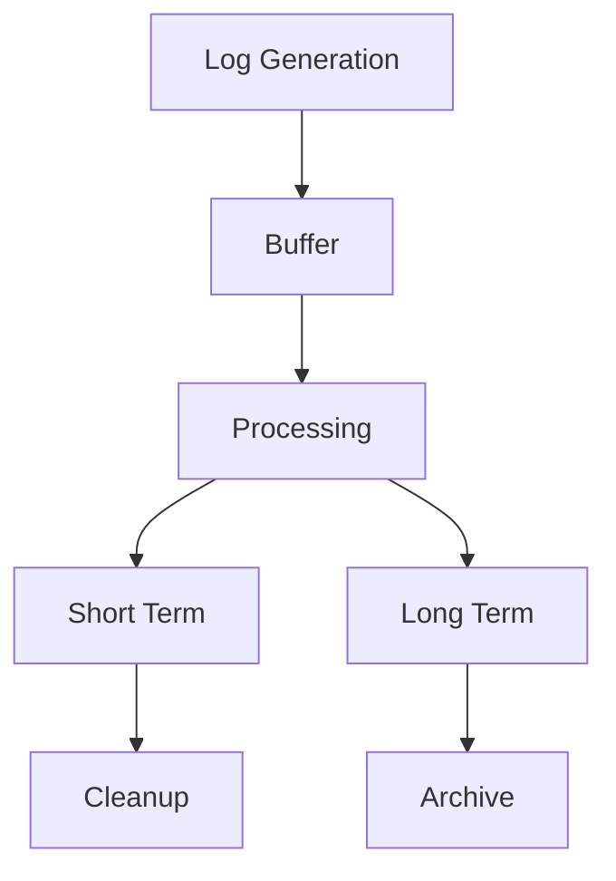

# Audit Log

## 1. Visão Geral

### 1.1 Propósito
Documentar todas as ações e eventos significativos no sistema para fins de auditoria, segurança e compliance.

### 1.2 Escopo
- Ações do usuário
- Eventos do sistema
- Alertas de segurança
- Mudanças de configuração
- Acesso a dados

## 2. Estrutura do Log

### 2.1 Formato Base
```json
{
    "id": "uuid",
    "timestamp": "ISO8601",
    "level": "INFO|WARN|ERROR",
    "event_type": "string",
    "source": {
        "service": "string",
        "component": "string",
        "instance": "string"
    },
    "actor": {
        "id": "string",
        "type": "USER|SYSTEM|SERVICE",
        "ip": "string"
    },
    "action": {
        "type": "CREATE|READ|UPDATE|DELETE",
        "status": "SUCCESS|FAILURE",
        "details": "object"
    },
    "resource": {
        "type": "string",
        "id": "string",
        "name": "string"
    },
    "metadata": {
        "trace_id": "string",
        "correlation_id": "string",
        "tags": ["string"]
    }
}
```

### 2.2 Níveis de Log
1. **INFO**: Operações normais
2. **WARN**: Situações suspeitas
3. **ERROR**: Falhas e violações
4. **DEBUG**: Detalhes técnicos
5. **AUDIT**: Eventos críticos

## 3. Eventos Auditados

### 3.1 Autenticação
```json
{
    "event_type": "AUTH",
    "action": {
        "type": "LOGIN",
        "status": "SUCCESS",
        "details": {
            "method": "2FA",
            "location": "São Paulo",
            "device": "Windows 10"
        }
    }
}
```

### 3.2 Acesso a Dados
```json
{
    "event_type": "DATA_ACCESS",
    "action": {
        "type": "READ",
        "status": "SUCCESS",
        "details": {
            "query": "SELECT",
            "tables": ["employees"],
            "filters": {"department": "IT"}
        }
    }
}
```

### 3.3 Configuração
```json
{
    "event_type": "CONFIG",
    "action": {
        "type": "UPDATE",
        "status": "SUCCESS",
        "details": {
            "component": "face_analyzer",
            "parameter": "threshold",
            "old_value": 0.8,
            "new_value": 0.9
        }
    }
}
```

## 4. Retenção e Armazenamento

### 4.1 Políticas
- Logs críticos: 5 anos
- Logs operacionais: 1 ano
- Logs de debug: 30 dias
- Logs de performance: 90 dias

### 4.2 Armazenamento


## 5. Monitoramento

### 5.1 Alertas
```json
{
    "alert_rules": {
        "security": {
            "failed_login": {
                "threshold": 5,
                "window": "5m",
                "action": "notify_security"
            },
            "data_access": {
                "threshold": 1000,
                "window": "1h",
                "action": "block_ip"
            }
        }
    }
}
```

### 5.2 Dashboards
- Security events
- Access patterns
- Error rates
- Performance metrics
- Compliance status

## 6. Compliance

### 6.1 LGPD/GDPR
- Acesso a dados pessoais
- Consentimento
- Retenção
- Anonimização
- Exportação

### 6.2 Segurança
- Tentativas de invasão
- Alterações de permissão
- Acesso privilegiado
- Mudanças críticas
- Eventos suspeitos

## 7. Integração

### 7.1 Coleta
```python
class AuditLogger:
    def log_event(self, event_type, actor, action, resource):
        event = {
            "id": generate_uuid(),
            "timestamp": get_utc_now(),
            "event_type": event_type,
            "actor": actor,
            "action": action,
            "resource": resource,
            "metadata": get_context()
        }
        self.validate_and_store(event)
```

### 7.2 Processamento
```python
class LogProcessor:
    def process(self, log_entry):
        # Enriquecimento
        self.enrich(log_entry)
        
        # Validação
        self.validate(log_entry)
        
        # Normalização
        normalized = self.normalize(log_entry)
        
        # Armazenamento
        self.store(normalized)
        
        # Alertas
        self.check_alerts(normalized)
```

## 8. Relatórios

### 8.1 Compliance
```sql
-- Exemplo de query para relatório
SELECT 
    date_trunc('day', timestamp) as day,
    event_type,
    action.type,
    count(*) as total,
    count(case when action.status = 'FAILURE' then 1 end) as failures
FROM audit_logs
WHERE timestamp >= now() - interval '30 days'
GROUP BY 1, 2, 3
ORDER BY 1 DESC
```

### 8.2 Segurança
- Tentativas de acesso
- Padrões suspeitos
- Violações de política
- Acesso a dados sensíveis
- Mudanças críticas

## 9. Ferramentas

### 9.1 Stack
- Elasticsearch
- Logstash
- Kibana
- Prometheus
- Grafana

### 9.2 Integração
```yaml
logstash:
  inputs:
    - tcp:
        port: 5000
        codec: json
    - beats:
        port: 5044
  
  filters:
    - grok:
        patterns: []
    - date:
        match: ["timestamp"]
    
  outputs:
    - elasticsearch:
        hosts: ["elasticsearch:9200"]
        index: "audit-logs-%{+YYYY.MM}"
```

## 10. Manutenção

### 10.1 Limpeza
```python
class LogMaintenance:
    def cleanup(self):
        # Regras de retenção
        retention_rules = {
            "CRITICAL": "5y",
            "OPERATIONAL": "1y",
            "DEBUG": "30d",
            "PERFORMANCE": "90d"
        }
        
        for log_type, retention in retention_rules.items():
            self.apply_retention_policy(log_type, retention)
```

### 10.2 Backup
- Daily incremental
- Weekly full
- Monthly archive
- Yearly consolidation
- Encrypted storage 