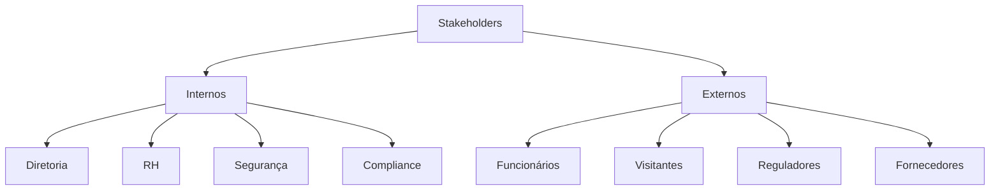
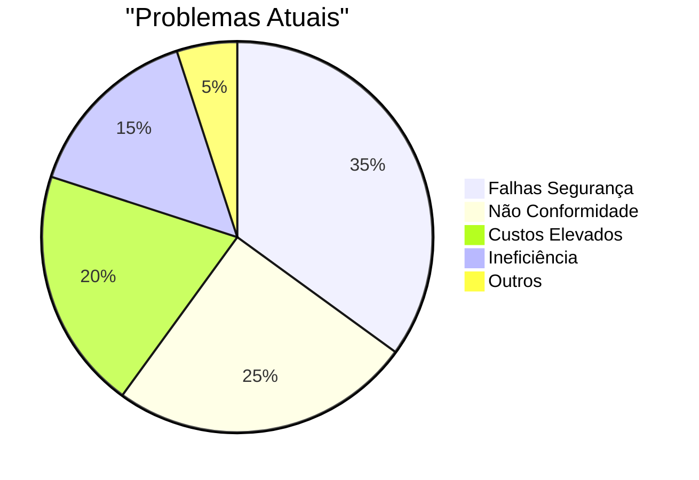
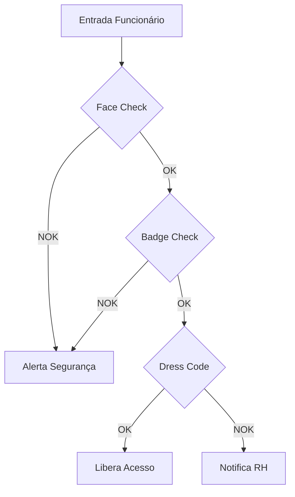
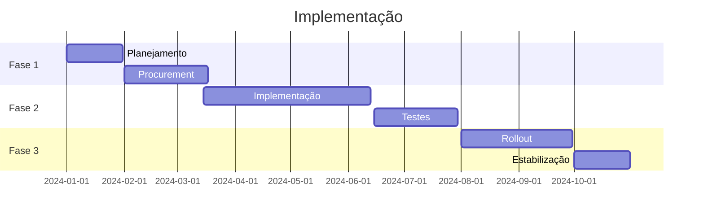
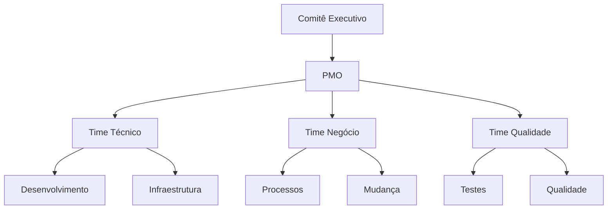

# Business Requirements Document (BRD)

## 1. Visão Geral

### 1.1 Propósito
O Big Brother CNN é um sistema de vigilância corporativa que utiliza inteligência artificial para monitorar e garantir a conformidade com políticas de segurança e procedimentos organizacionais.

### 1.2 Objetivos de Negócio
1. Aumentar segurança corporativa
2. Reduzir riscos operacionais
3. Garantir compliance
4. Otimizar processos
5. Reduzir custos

## 2. Stakeholders

### 2.1 Principais Interessados


### 2.2 Responsabilidades
| Stakeholder | Papel | Responsabilidades |
|-------------|-------|------------------|
| Diretoria | Sponsor | Aprovação, Budget |
| RH | Gestor | Políticas, Treinamento |
| Segurança | Operador | Monitoramento, Resposta |
| Compliance | Auditor | Conformidade, Relatórios |

## 3. Necessidades de Negócio

### 3.1 Segurança
```json
{
    "necessidades": {
        "controle_acesso": {
            "prioridade": "alta",
            "beneficios": [
                "prevenção de acessos não autorizados",
                "rastreabilidade",
                "resposta rápida a incidentes"
            ]
        },
        "monitoramento": {
            "prioridade": "alta",
            "beneficios": [
                "vigilância 24/7",
                "detecção de anomalias",
                "evidências em incidentes"
            ]
        }
    }
}
```

### 3.2 Compliance
```yaml
compliance_requirements:
  politicas:
    - dress_code
    - segurança
    - horários
    - comportamento
  
  regulamentações:
    - LGPD
    - normas_trabalho
    - segurança_trabalho
    
  auditorias:
    - internas
    - externas
    - regulatórias
```

## 4. Análise de Mercado

### 4.1 Situação Atual


### 4.2 Benefícios Esperados
- ROI: 300% em 3 anos
- Redução de incidentes: 80%
- Economia em pessoal: 50%
- Tempo resposta: -70%
- Conformidade: 99.9%

## 5. Requisitos de Negócio

### 5.1 Funcionais
```python
class BusinessRequirements:
    def __init__(self):
        self.requirements = {
            "face_recognition": {
                "priority": "high",
                "value": "identificação precisa",
                "metrics": "accuracy > 95%"
            },
            "dress_code": {
                "priority": "medium",
                "value": "conformidade visual",
                "metrics": "violations < 5%"
            },
            "behavior_analysis": {
                "priority": "high",
                "value": "segurança proativa",
                "metrics": "prevention > 90%"
            }
        }
```

### 5.2 Não-Funcionais
1. Disponibilidade 24/7
2. Tempo resposta < 1s
3. Falsos positivos < 1%
4. Backup automático
5. Auditoria completa

## 6. Processos de Negócio

### 6.1 Fluxos Principais


### 6.2 Integrações
- Sistema RH
- Controle Acesso
- ERP
- Câmeras
- Alertas

## 7. Análise Financeira

### 7.1 Custos
```json
{
    "custos": {
        "implementacao": {
            "hardware": 500000,
            "software": 300000,
            "servicos": 200000
        },
        "operacao": {
            "mensal": {
                "infraestrutura": 10000,
                "suporte": 5000,
                "licencas": 3000
            }
        }
    }
}
```

### 7.2 Benefícios
- Redução pessoal: R$ 1M/ano
- Prevenção perdas: R$ 500k/ano
- Eficiência: R$ 300k/ano
- Compliance: R$ 200k/ano

## 8. Riscos e Mitigação

### 8.1 Análise de Riscos
```python
class RiskAnalysis:
    def __init__(self):
        self.risks = {
            "tecnologico": {
                "probabilidade": "media",
                "impacto": "alto",
                "mitigacao": [
                    "POC extensivo",
                    "fornecedores tier 1",
                    "suporte premium"
                ]
            },
            "regulatorio": {
                "probabilidade": "baixa",
                "impacto": "alto",
                "mitigacao": [
                    "consultoria legal",
                    "auditorias regulares",
                    "atualizações constantes"
                ]
            }
        }
```

### 8.2 Plano de Contingência
1. Backup manual
2. Procedimentos alternativos
3. Equipe redundante
4. Comunicação clara
5. Rollback plan

## 9. Cronograma

### 9.1 Fases


### 9.2 Milestones
1. Kick-off: Jan/2024
2. POC: Mar/2024
3. Piloto: Jun/2024
4. Go-live: Aug/2024
5. Handover: Oct/2024

## 10. Governança

### 10.1 Estrutura


### 10.2 Papéis
- Sponsor
- Project Manager
- Business Analyst
- Technical Lead
- Quality Lead

## 11. Métricas de Sucesso

### 11.1 KPIs
```json
{
    "kpis": {
        "seguranca": {
            "incidentes": "-80%",
            "tempo_resposta": "-70%",
            "falsos_positivos": "<1%"
        },
        "operacional": {
            "uptime": ">99.9%",
            "performance": "<1s",
            "cobertura": "100%"
        },
        "financeiro": {
            "roi": "300%",
            "payback": "18 meses",
            "economia": "2M/ano"
        }
    }
}
```

### 11.2 Monitoramento
- Dashboards real-time
- Relatórios semanais
- Reviews mensais
- Auditorias trimestrais
- Avaliação anual 