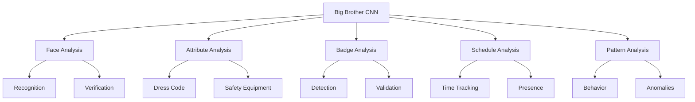
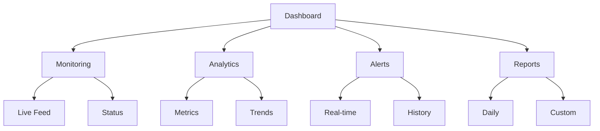
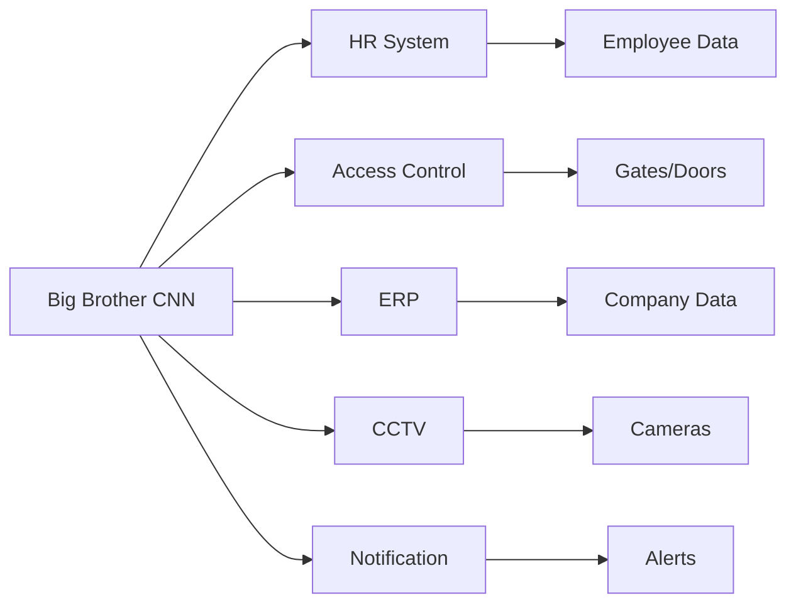
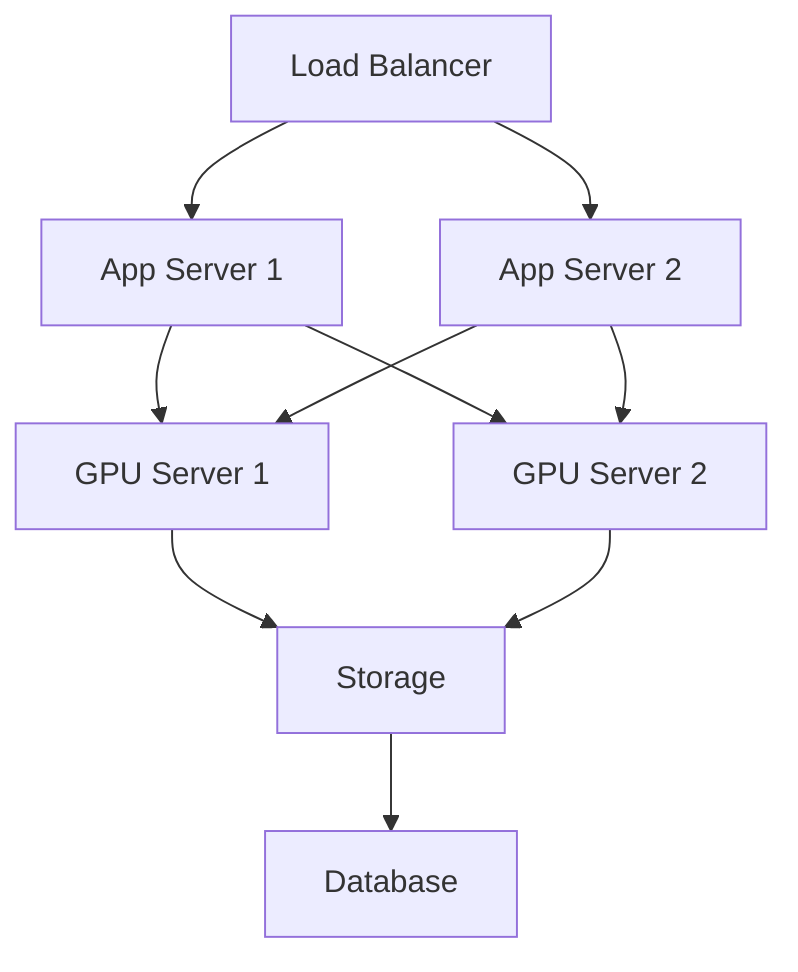

# Product Requirements Document (PRD)

## 1. Visão do Produto

### 1.1 Objetivo
O Big Brother CNN é uma solução de vigilância corporativa que utiliza inteligência artificial para monitoramento automático e contínuo de conformidade e segurança.

### 1.2 Escopo


## 2. Funcionalidades

### 2.1 Face Analyzer
```python
class FaceAnalyzer:
    features = {
        "detection": {
            "multi_face": True,
            "angles": [-45, 45],
            "min_size": "50x50px",
            "occlusion": True
        },
        "recognition": {
            "accuracy": 0.95,
            "speed": "100ms",
            "database": "dynamic",
            "updates": "real-time"
        },
        "verification": {
            "liveness": True,
            "anti_spoofing": True,
            "confidence": 0.98
        }
    }
```

### 2.2 Attribute Analyzer
```json
{
    "attributes": {
        "dress_code": {
            "uniforme": {
                "required": true,
                "colors": ["azul", "branco"],
                "tipos": ["social", "operacional"]
            },
            "epi": {
                "required": true,
                "items": [
                    "capacete",
                    "colete",
                    "botas"
                ]
            }
        }
    }
}
```

## 3. Interface do Usuário

### 3.1 Dashboard Principal


### 3.2 Telas Principais
1. **Monitoramento ao Vivo**
   - Multi-câmera view
   - Status indicators
   - Quick actions
   - Filter options

2. **Gestão de Alertas**
   - Priority queue
   - Assignment
   - Status tracking
   - Resolution flow

3. **Análise de Dados**
   - Metrics dashboard
   - Trend analysis
   - Custom reports
   - Export options

## 4. Requisitos Técnicos

### 4.1 Performance
```yaml
performance_requirements:
  latency:
    detection: < 100ms
    recognition: < 200ms
    total_processing: < 500ms
    
  throughput:
    cameras_per_server: 20
    fps_per_camera: 30
    concurrent_users: 100
    
  accuracy:
    face_recognition: > 95%
    attribute_detection: > 90%
    badge_reading: > 98%
```

### 4.2 Escalabilidade
```python
class ScalabilityRequirements:
    def __init__(self):
        self.requirements = {
            "horizontal": {
                "max_nodes": 100,
                "node_capacity": "20 cameras",
                "scaling_trigger": "80% CPU/GPU"
            },
            "storage": {
                "video_retention": "30 days",
                "metadata_retention": "365 days",
                "backup_frequency": "daily"
            },
            "network": {
                "bandwidth_per_camera": "10Mbps",
                "total_bandwidth": "10Gbps",
                "redundancy": True
            }
        }
```

## 5. Integrações

### 5.1 Sistemas Externos


### 5.2 APIs
```json
{
    "apis": {
        "rest": {
            "endpoints": [
                "/api/v1/analysis",
                "/api/v1/alerts",
                "/api/v1/reports"
            ],
            "methods": ["GET", "POST", "PUT"],
            "auth": "OAuth2",
            "rate_limit": "1000/min"
        },
        "websocket": {
            "streams": [
                "/ws/live-feed",
                "/ws/alerts"
            ],
            "protocols": ["WSS"],
            "compression": true
        }
    }
}
```

## 6. Segurança

### 6.1 Autenticação e Autorização
```python
class SecurityConfig:
    def __init__(self):
        self.auth = {
            "methods": ["OAuth2", "2FA"],
            "roles": ["admin", "operator", "viewer"],
            "permissions": {
                "admin": ["*"],
                "operator": ["view", "acknowledge"],
                "viewer": ["view"]
            },
            "session": {
                "timeout": 30,
                "max_concurrent": 2
            }
        }
```

### 6.2 Proteção de Dados
- Encryption at rest
- Encryption in transit
- Data masking
- Access logging
- Audit trail

## 7. Monitoramento

### 7.1 Métricas
```json
{
    "metrics": {
        "system": {
            "cpu_usage": "gauge",
            "gpu_usage": "gauge",
            "memory_usage": "gauge",
            "disk_usage": "gauge"
        },
        "application": {
            "detection_rate": "counter",
            "recognition_accuracy": "gauge",
            "alert_count": "counter",
            "response_time": "histogram"
        },
        "business": {
            "violations": "counter",
            "compliance_rate": "gauge",
            "incident_resolution": "histogram"
        }
    }
}
```

### 7.2 Alertas
```yaml
alert_rules:
  system:
    - name: high_cpu
      threshold: 80%
      duration: 5m
      severity: warning
    
    - name: high_memory
      threshold: 90%
      duration: 5m
      severity: critical
      
  application:
    - name: low_accuracy
      threshold: < 90%
      duration: 15m
      severity: warning
      
    - name: high_latency
      threshold: > 500ms
      duration: 5m
      severity: critical
```

## 8. Deployment

### 8.1 Arquitetura


### 8.2 Requisitos
```python
class DeploymentRequirements:
    def __init__(self):
        self.infrastructure = {
            "app_servers": {
                "cpu": "16 cores",
                "memory": "64GB",
                "storage": "500GB SSD"
            },
            "gpu_servers": {
                "gpu": "NVIDIA A100",
                "memory": "128GB",
                "storage": "2TB NVMe"
            },
            "storage": {
                "type": "SAN",
                "capacity": "100TB",
                "raid": "RAID 10"
            }
        }
```

## 9. Manutenção

### 9.1 Updates
- Security patches: Weekly
- Bug fixes: Bi-weekly
- Feature updates: Monthly
- Major releases: Quarterly

### 9.2 Backup
```json
{
    "backup_policy": {
        "full": {
            "frequency": "weekly",
            "retention": "3 months"
        },
        "incremental": {
            "frequency": "daily",
            "retention": "1 month"
        },
        "database": {
            "frequency": "hourly",
            "retention": "7 days"
        }
    }
}
```

## 10. Documentação

### 10.1 Técnica
- API documentation
- System architecture
- Database schema
- Network diagram
- Security protocols

### 10.2 Usuário
- User manual
- Admin guide
- Installation guide
- Troubleshooting
- FAQ 