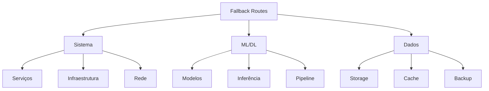
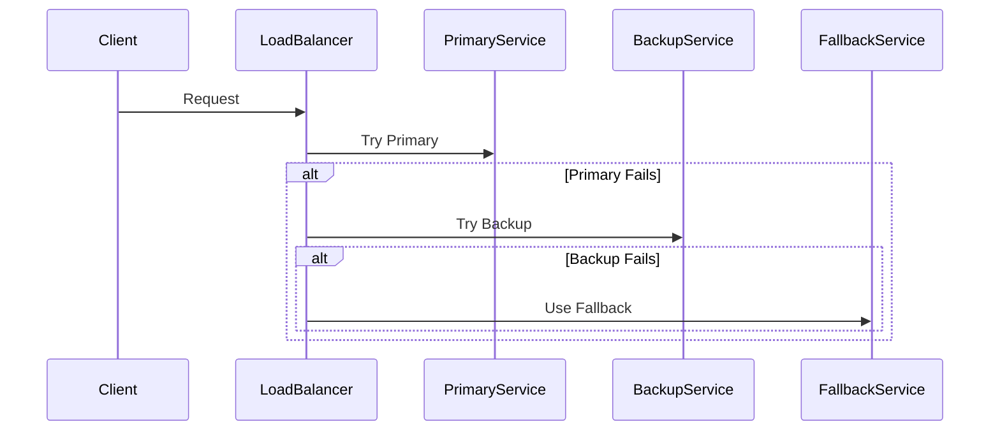

# Plano de Rotas de Fallback

## 1. Visão Geral

### 1.1 Objetivo
Este documento define as estratégias e rotas de fallback para garantir a continuidade operacional do sistema Big Brother CNN em caso de falhas.

### 1.2 Escopo


## 2. Estratégias de Fallback

### 2.1 Sistema
```python
class SystemFallback:
    def __init__(self):
        self.strategies = {
            "service_failure": {
                "primary": "service_restart",
                "secondary": "failover_instance",
                "tertiary": "manual_intervention",
                "timeout": 300  # seconds
            },
            "infrastructure": {
                "primary": "auto_scaling",
                "secondary": "backup_resources",
                "tertiary": "degraded_mode",
                "timeout": 600
            },
            "network": {
                "primary": "alternate_route",
                "secondary": "backup_link",
                "tertiary": "offline_mode",
                "timeout": 180
            }
        }
```

### 2.2 ML/DL
```json
{
    "ml_fallback": {
        "model_failure": {
            "strategies": [
                {
                    "name": "model_rollback",
                    "description": "Reverter para última versão estável",
                    "timeout": 60
                },
                {
                    "name": "lightweight_model",
                    "description": "Usar modelo mais simples",
                    "timeout": 30
                },
                {
                    "name": "rule_based",
                    "description": "Usar regras predefinidas",
                    "timeout": 10
                }
            ]
        },
        "inference": {
            "strategies": [
                {
                    "name": "batch_processing",
                    "description": "Acumular para processamento posterior",
                    "buffer_size": 1000
                },
                {
                    "name": "reduced_precision",
                    "description": "Usar precisão reduzida",
                    "threshold": 0.8
                }
            ]
        }
    }
}
```

## 3. Rotas de Contingência

### 3.1 Serviços
```yaml
service_routes:
  face_recognition:
    - route: primary
      endpoint: /api/v1/face
      fallback: /api/v1/face-backup
      timeout: 2s
      
    - route: secondary
      endpoint: /api/v1/face-simple
      fallback: /api/v1/rules
      timeout: 1s
      
  attribute_analysis:
    - route: primary
      endpoint: /api/v1/attributes
      fallback: /api/v1/attr-backup
      timeout: 2s
      
    - route: secondary
      endpoint: /api/v1/basic-attr
      fallback: /api/v1/rules
      timeout: 1s
```

### 3.2 Fluxo


## 4. Degradação Graciosa

### 4.1 Níveis
```python
class DegradationLevels:
    def __init__(self):
        self.levels = {
            "level_1": {
                "condition": "high_load",
                "actions": [
                    "reduce_logging",
                    "increase_caching",
                    "skip_non_critical"
                ],
                "threshold": {
                    "cpu": 80,
                    "memory": 85,
                    "latency": 200
                }
            },
            "level_2": {
                "condition": "very_high_load",
                "actions": [
                    "disable_features",
                    "simple_models",
                    "batch_processing"
                ],
                "threshold": {
                    "cpu": 90,
                    "memory": 95,
                    "latency": 500
                }
            },
            "level_3": {
                "condition": "critical",
                "actions": [
                    "essential_only",
                    "reject_new",
                    "emergency_mode"
                ],
                "threshold": {
                    "cpu": 95,
                    "memory": 98,
                    "latency": 1000
                }
            }
        }
```

### 4.2 Features
| Nível | Face | Attribute | Badge | Schedule | Pattern |
|-------|------|-----------|--------|----------|----------|
| Normal | Full | Full | Full | Full | Full |
| L1 | Full | Simple | Full | Batch | Off |
| L2 | Simple | Off | Simple | Off | Off |
| L3 | Basic | Off | Basic | Off | Off |

## 5. Recuperação

### 5.1 Procedimentos
```json
{
    "recovery": {
        "service": {
            "steps": [
                "verify_health",
                "restore_state",
                "validate_data",
                "resume_service"
            ],
            "validation": {
                "health_check": "/health",
                "metrics_check": "/metrics",
                "data_check": "/validate"
            }
        },
        "data": {
            "steps": [
                "verify_integrity",
                "restore_backup",
                "validate_consistency",
                "resume_processing"
            ],
            "validation": {
                "integrity_check": true,
                "consistency_check": true,
                "processing_check": true
            }
        }
    }
}
```

### 5.2 Validação
```yaml
validation:
  service:
    - endpoint: /health
      expect: 200
      timeout: 5s
      
    - endpoint: /metrics
      expect: 200
      timeout: 5s
      
  data:
    - check: integrity
      sql: "SELECT check_integrity()"
      expect: true
      
    - check: consistency
      sql: "SELECT check_consistency()"
      expect: true
```

## 6. Monitoramento

### 6.1 Métricas
```python
class FallbackMetrics:
    def __init__(self):
        self.metrics = {
            "availability": {
                "type": "gauge",
                "labels": ["service", "route"],
                "thresholds": {
                    "warning": 0.95,
                    "critical": 0.90
                }
            },
            "fallback_rate": {
                "type": "counter",
                "labels": ["service", "route", "reason"],
                "alert": "increasing"
            },
            "recovery_time": {
                "type": "histogram",
                "labels": ["service", "route"],
                "buckets": [10, 30, 60, 120, 300]
            }
        }
```

### 6.2 Alertas
```yaml
alerts:
  high_fallback_rate:
    condition: rate(fallback_total[5m]) > 0.1
    severity: warning
    annotation: "High fallback rate detected"
    
  failed_recovery:
    condition: recovery_failed > 0
    severity: critical
    annotation: "Recovery procedure failed"
```

## 7. Testes

### 7.1 Simulações
```json
{
    "simulations": {
        "service_failure": {
            "scenarios": [
                {
                    "name": "primary_down",
                    "actions": [
                        "stop_primary",
                        "verify_fallback",
                        "check_metrics"
                    ]
                },
                {
                    "name": "network_partition",
                    "actions": [
                        "isolate_network",
                        "verify_alternate",
                        "check_connectivity"
                    ]
                }
            ]
        }
    }
}
```

### 7.2 Validação
- Testes periódicos
- Chaos engineering
- Disaster recovery
- Performance tests
- Security checks

## 8. Documentação

### 8.1 Runbooks
```yaml
runbooks:
  service_failure:
    - title: "Primary Service Recovery"
      steps:
        - verify_status
        - check_logs
        - restart_service
        - validate_health
        
  data_loss:
    - title: "Data Recovery"
      steps:
        - assess_damage
        - restore_backup
        - verify_integrity
        - resume_operation
```

### 8.2 Playbooks
- Incident response
- Recovery procedures
- Escalation paths
- Contact information
- Quick references

## 9. Manutenção

### 9.1 Revisões
```python
class MaintenanceSchedule:
    def __init__(self):
        self.schedule = {
            "daily": [
                "check_logs",
                "verify_metrics",
                "test_health"
            ],
            "weekly": [
                "test_fallback",
                "verify_backups",
                "update_docs"
            ],
            "monthly": [
                "full_dr_test",
                "review_procedures",
                "update_contacts"
            ]
        }
```

### 9.2 Updates
- Procedimentos
- Contatos
- Documentação
- Ferramentas
- Treinamentos

## 10. Compliance

### 10.1 Requisitos
```json
{
    "compliance": {
        "availability": {
            "sla": 99.9,
            "mttr": "4h",
            "rto": "2h",
            "rpo": "15min"
        },
        "security": {
            "encryption": true,
            "audit_logs": true,
            "access_control": true
        },
        "privacy": {
            "data_protection": true,
            "anonymization": true,
            "retention": "90d"
        }
    }
}
```

### 10.2 Auditoria
- Logs completos
- Trilha de auditoria
- Relatórios regulares
- Revisões periódicas
- Certificações 