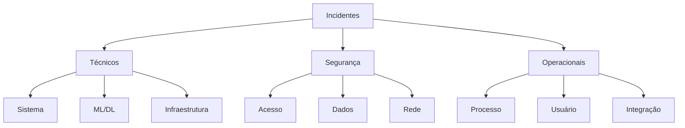
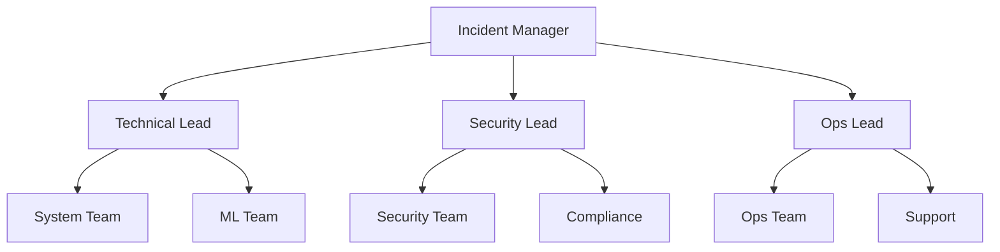
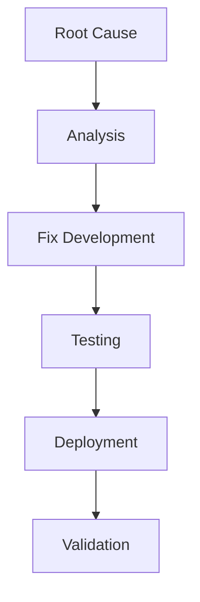

# Plano de Resposta a Incidentes

## 1. Visão Geral

### 1.1 Objetivo
Este documento define os procedimentos e responsabilidades para resposta a incidentes no sistema Big Brother CNN.

### 1.2 Escopo


## 2. Classificação de Incidentes

### 2.1 Níveis de Severidade
| Nível | Descrição | Tempo Resposta | Tempo Resolução |
|-------|-----------|----------------|-----------------|
| P1 | Crítico | 15 min | 2 horas |
| P2 | Alto | 30 min | 4 horas |
| P3 | Médio | 2 horas | 8 horas |
| P4 | Baixo | 4 horas | 24 horas |

### 2.2 Categorias
```python
class IncidentCategories:
    def __init__(self):
        self.categories = {
            "system_failure": {
                "severity": "P1",
                "examples": [
                    "sistema indisponível",
                    "perda de dados",
                    "falha crítica ML"
                ]
            },
            "security_breach": {
                "severity": "P1",
                "examples": [
                    "acesso não autorizado",
                    "vazamento de dados",
                    "ataque detectado"
                ]
            },
            "performance": {
                "severity": "P2",
                "examples": [
                    "latência alta",
                    "degradação ML",
                    "sobrecarga"
                ]
            }
        }
```

## 3. Time de Resposta

### 3.1 Estrutura


### 3.2 Responsabilidades
```yaml
roles:
  incident_manager:
    - coordenação geral
    - comunicação
    - escalação
    - reporting
    
  technical_lead:
    - análise técnica
    - troubleshooting
    - implementação fix
    - validação
    
  security_lead:
    - análise segurança
    - contenção
    - investigação
    - remediação
```

## 4. Procedimentos

### 4.1 Detecção e Registro
```json
{
    "detection": {
        "sources": [
            "monitoring_alerts",
            "user_reports",
            "security_alerts",
            "system_logs"
        ],
        "tools": {
            "monitoring": "Prometheus/Grafana",
            "logging": "ELK Stack",
            "security": "SIEM"
        },
        "metrics": {
            "detection_time": "timestamp",
            "alert_source": "string",
            "initial_severity": "enum"
        }
    }
}
```

### 4.2 Resposta Inicial
1. Confirmação do incidente
2. Classificação inicial
3. Notificação do time
4. Registro formal
5. Início contenção

## 5. Contenção e Erradicação

### 5.1 Contenção
```python
class ContainmentProcedures:
    def __init__(self):
        self.procedures = {
            "system": {
                "isolation": [
                    "identificar componentes",
                    "isolar sistema afetado",
                    "ativar contingência"
                ],
                "mitigation": [
                    "aplicar fixes emergenciais",
                    "ajustar configurações",
                    "limitar acesso"
                ]
            },
            "security": {
                "isolation": [
                    "bloquear acessos",
                    "revogar credenciais",
                    "ativar WAF"
                ],
                "mitigation": [
                    "patch emergencial",
                    "update regras",
                    "aumentar monitoramento"
                ]
            }
        }
```

### 5.2 Erradicação


## 6. Recuperação

### 6.1 Procedimentos
```yaml
recovery_procedures:
  system:
    - validate_fixes
    - restore_services
    - verify_data
    - test_functionality
    
  security:
    - patch_systems
    - update_credentials
    - restore_access
    - verify_controls
    
  operations:
    - resume_services
    - notify_users
    - verify_processes
    - monitor_status
```

### 6.2 Validação
- Testes funcionais
- Verificação segurança
- Monitoramento
- Sign-off formal

## 7. Comunicação

### 7.1 Matriz de Comunicação
| Stakeholder | Quando Notificar | Meio | Frequência |
|-------------|------------------|------|------------|
| Executivo | P1/P2 | Email/SMS | Início + 2h |
| Técnico | Todos | Slack/Email | Tempo real |
| Usuários | Impacto | Email | 4h |
| Clientes | Serviço | Email | 4h |

### 7.2 Templates
```json
{
    "templates": {
        "initial_notification": {
            "subject": "Incident Alert: [ID] - [Severity]",
            "body": {
                "what": "description",
                "impact": "services affected",
                "actions": "current steps",
                "next": "next update time"
            }
        },
        "status_update": {
            "subject": "Incident Update: [ID]",
            "body": {
                "status": "current state",
                "progress": "actions taken",
                "pending": "next steps",
                "eta": "estimated resolution"
            }
        }
    }
}
```

## 8. Pós-Incidente

### 8.1 Análise
```python
class PostMortem:
    def __init__(self):
        self.analysis = {
            "timeline": {
                "detection": "timestamp",
                "response": "timestamp",
                "resolution": "timestamp"
            },
            "impact": {
                "services": ["list"],
                "users": "count",
                "duration": "hours"
            },
            "root_cause": {
                "technical": "description",
                "process": "description",
                "contributing": ["factors"]
            }
        }
```

### 8.2 Melhorias
1. Lições aprendidas
2. Atualizações processos
3. Ajustes ferramentas
4. Treinamentos
5. Documentação

## 9. Simulações e Treinamentos

### 9.1 Tipos de Simulação
```yaml
simulation_types:
  technical:
    - system_failure
    - ml_degradation
    - data_corruption
    
  security:
    - breach_simulation
    - ddos_test
    - data_leak
    
  operational:
    - process_failure
    - communication_test
    - recovery_drill
```

### 9.2 Cronograma
- Table-top: Mensal
- Técnica: Trimestral
- Full-scale: Semestral
- Security: Trimestral

## 10. Recursos

### 10.1 Ferramentas
```json
{
    "tools": {
        "monitoring": {
            "system": "Prometheus",
            "logs": "ELK",
            "alerts": "AlertManager"
        },
        "communication": {
            "chat": "Slack",
            "calls": "Zoom",
            "tickets": "Jira"
        },
        "documentation": {
            "wiki": "Confluence",
            "runbooks": "GitBook",
            "reports": "Sharepoint"
        }
    }
}
```

### 10.2 Contatos
- Emergency: 24/7
- Technical: On-call
- Security: SOC
- Management: Escalation 