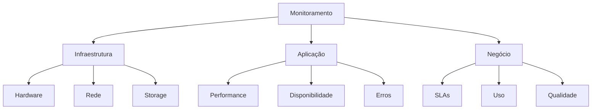
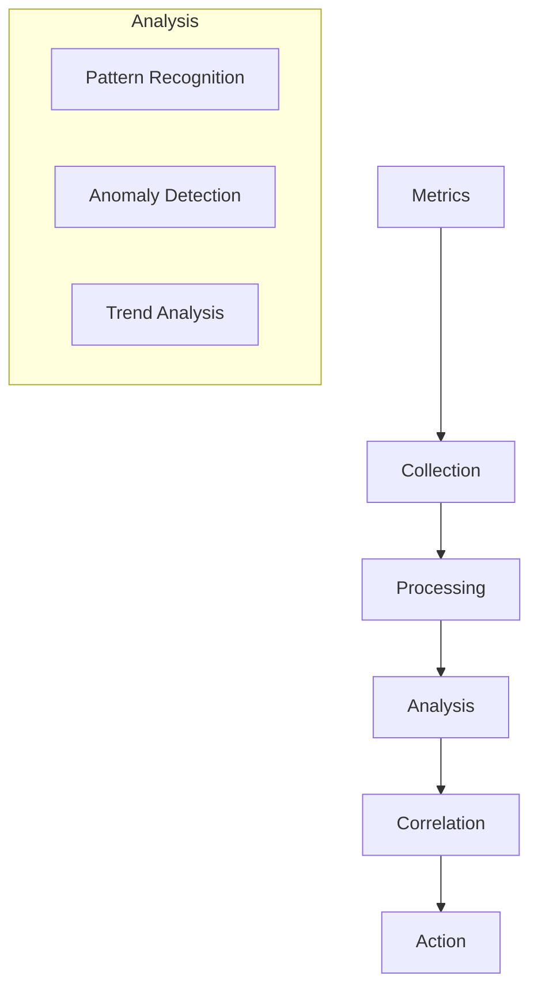

# Plano de Monitoramento

## 1. Visão Geral

### 1.1 Objetivo
Este documento define a estratégia e os procedimentos de monitoramento do sistema Big Brother CNN.

### 1.2 Escopo


## 2. Métricas Chave

### 2.1 Infraestrutura
```python
class InfraMetrics:
    def __init__(self):
        self.metrics = {
            "hardware": {
                "cpu": {
                    "usage": "percentage",
                    "threshold": 80,
                    "interval": "1m"
                },
                "memory": {
                    "usage": "percentage",
                    "threshold": 85,
                    "interval": "1m"
                },
                "gpu": {
                    "usage": "percentage",
                    "utilization": "float",
                    "memory": "percentage",
                    "threshold": 90,
                    "interval": "30s"
                }
            },
            "network": {
                "bandwidth": "Mbps",
                "latency": "ms",
                "packets": "count",
                "errors": "count"
            },
            "storage": {
                "usage": "percentage",
                "iops": "count",
                "latency": "ms"
            }
        }
```

### 2.2 Aplicação
```json
{
    "app_metrics": {
        "performance": {
            "response_time": {
                "type": "histogram",
                "buckets": [10, 50, 100, 200, 500],
                "unit": "ms"
            },
            "throughput": {
                "type": "counter",
                "unit": "requests/sec"
            },
            "error_rate": {
                "type": "gauge",
                "unit": "percentage"
            }
        },
        "ml_metrics": {
            "inference_time": {
                "type": "histogram",
                "unit": "ms"
            },
            "accuracy": {
                "type": "gauge",
                "unit": "percentage"
            },
            "confidence": {
                "type": "histogram",
                "unit": "score"
            }
        }
    }
}
```

## 3. Coleta de Dados

### 3.1 Agentes
```yaml
collectors:
  node_exporter:
    metrics:
      - cpu
      - memory
      - disk
      - network
    interval: 15s
    retention: 30d
    
  gpu_exporter:
    metrics:
      - utilization
      - memory
      - temperature
      - power
    interval: 30s
    retention: 30d
    
  app_exporter:
    metrics:
      - custom_metrics
      - business_metrics
      - ml_metrics
    interval: 10s
    retention: 90d
```

### 3.2 Pipeline


## 4. Armazenamento

### 4.1 Time Series DB
```python
class MetricStorage:
    def __init__(self):
        self.config = {
            "prometheus": {
                "retention": "30d",
                "scrape_interval": "15s",
                "evaluation_interval": "15s",
                "storage": {
                    "tsdb": {
                        "retention_time": "30d",
                        "min_block_duration": "2h",
                        "max_block_duration": "24h"
                    }
                }
            },
            "elasticsearch": {
                "retention": "90d",
                "shards": 5,
                "replicas": 1,
                "refresh_interval": "30s"
            }
        }
```

### 4.2 Retenção
| Tipo | Agregação | Retenção |
|------|-----------|----------|
| Raw | None | 7 dias |
| 5min | Avg/Max/Min | 30 dias |
| 1h | Avg/Max/Min | 90 dias |
| 1d | Avg/Max/Min | 1 ano |

## 5. Visualização

### 5.1 Dashboards
```json
{
    "dashboards": {
        "overview": {
            "refresh": "30s",
            "panels": [
                {
                    "title": "System Health",
                    "type": "status",
                    "metrics": [
                        "cpu",
                        "memory",
                        "disk",
                        "network"
                    ]
                },
                {
                    "title": "ML Performance",
                    "type": "graph",
                    "metrics": [
                        "accuracy",
                        "latency",
                        "throughput"
                    ]
                },
                {
                    "title": "Business KPIs",
                    "type": "stats",
                    "metrics": [
                        "detections",
                        "alerts",
                        "compliance"
                    ]
                }
            ]
        }
    }
}
```

### 5.2 Alertas
```yaml
alert_rules:
  system:
    - name: high_cpu
      expr: cpu_usage > 80
      for: 5m
      labels:
        severity: warning
      annotations:
        description: "CPU usage above 80%"
        
    - name: high_memory
      expr: memory_usage > 85
      for: 5m
      labels:
        severity: warning
      annotations:
        description: "Memory usage above 85%"
        
  application:
    - name: high_latency
      expr: response_time_95th > 200
      for: 5m
      labels:
        severity: critical
      annotations:
        description: "Response time above 200ms"
```

## 6. Análise

### 6.1 Correlação


### 6.2 Machine Learning
```python
class MetricAnalysis:
    def __init__(self):
        self.analysis = {
            "anomaly_detection": {
                "algorithm": "isolation_forest",
                "features": [
                    "cpu_usage",
                    "memory_usage",
                    "response_time",
                    "error_rate"
                ],
                "window": "1h",
                "threshold": 0.95
            },
            "forecasting": {
                "algorithm": "prophet",
                "metrics": [
                    "resource_usage",
                    "request_rate",
                    "error_rate"
                ],
                "horizon": "24h",
                "interval": "1h"
            }
        }
```

## 7. Resposta

### 7.1 Auto-healing
```json
{
    "auto_healing": {
        "rules": {
            "high_memory": {
                "condition": "memory > 90%",
                "actions": [
                    "restart_service",
                    "scale_up"
                ],
                "cooldown": "5m"
            },
            "high_latency": {
                "condition": "latency > 500ms",
                "actions": [
                    "cache_flush",
                    "load_balance"
                ],
                "cooldown": "2m"
            }
        }
    }
}
```

### 7.2 Escalação
```yaml
escalation:
  levels:
    - level: 1
      team: ops
      response_time: 15m
      
    - level: 2
      team: engineering
      response_time: 30m
      
    - level: 3
      team: management
      response_time: 1h
```

## 8. Relatórios

### 8.1 Operacional
```python
class Reports:
    def __init__(self):
        self.reports = {
            "daily": {
                "metrics": [
                    "system_health",
                    "performance",
                    "incidents"
                ],
                "format": "pdf",
                "delivery": "email"
            },
            "weekly": {
                "metrics": [
                    "trends",
                    "capacity",
                    "sla"
                ],
                "format": "dashboard",
                "delivery": "portal"
            },
            "monthly": {
                "metrics": [
                    "compliance",
                    "efficiency",
                    "cost"
                ],
                "format": "presentation",
                "delivery": "meeting"
            }
        }
```

### 8.2 SLAs
| Métrica | Target | Warning | Critical |
|---------|--------|---------|----------|
| Uptime | 99.9% | 99.5% | 99% |
| Latency | 200ms | 500ms | 1s |
| Errors | 0.1% | 0.5% | 1% |
| Accuracy | 95% | 90% | 85% |

## 9. Manutenção

### 9.1 Backup
```json
{
    "backup": {
        "metrics": {
            "frequency": "daily",
            "retention": "90d",
            "type": "incremental"
        },
        "dashboards": {
            "frequency": "weekly",
            "retention": "1y",
            "type": "full"
        },
        "alerts": {
            "frequency": "monthly",
            "retention": "1y",
            "type": "full"
        }
    }
}
```

### 9.2 Limpeza
```yaml
cleanup:
  metrics:
    - age: 7d
      resolution: raw
    - age: 30d
      resolution: 5min
    - age: 90d
      resolution: 1h
    - age: 1y
      resolution: 1d
      
  logs:
    - age: 30d
      type: debug
    - age: 90d
      type: info
    - age: 1y
      type: error
```

## 10. Documentação

### 10.1 Runbooks
- Troubleshooting
- Recovery procedures
- Escalation paths
- Contact information
- Quick references

### 10.2 Playbooks
- Alert response
- Incident management
- Performance tuning
- Capacity planning
- Security events 