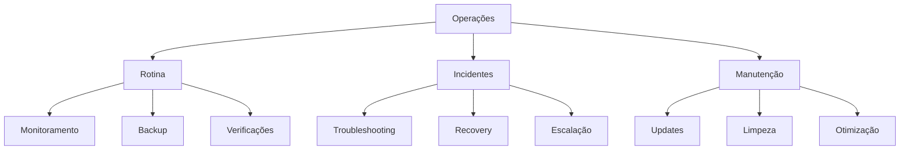

# Runbook

## 1. Visão Geral

### 1.1 Propósito
Este runbook contém procedimentos operacionais detalhados para o sistema Big Brother CNN.

### 1.2 Escopo


## 2. Procedimentos de Rotina

### 2.1 Verificações Diárias
```python
class DailyChecks:
    def __init__(self):
        self.checks = {
            "system": {
                "cpu_usage": "< 80%",
                "memory_usage": "< 85%",
                "disk_space": "< 80%",
                "gpu_usage": "< 90%"
            },
            "application": {
                "services_status": "all green",
                "error_rate": "< 0.1%",
                "response_time": "< 200ms",
                "queue_size": "< 1000"
            },
            "ml": {
                "model_accuracy": "> 95%",
                "inference_time": "< 100ms",
                "batch_success": "> 99%"
            }
        }
```

### 2.2 Monitoramento
```yaml
monitoring_tasks:
  system:
    - check: resources
      interval: 5m
      alert_threshold: 80%
      
    - check: services
      interval: 1m
      alert_threshold: any_down
      
  application:
    - check: endpoints
      interval: 30s
      alert_threshold: 500ms
      
    - check: errors
      interval: 1m
      alert_threshold: 1%
```

## 3. Troubleshooting

### 3.1 Problemas Comuns
```json
{
    "common_issues": {
        "high_latency": {
            "symptoms": [
                "response time > 200ms",
                "increasing queue size",
                "high CPU usage"
            ],
            "checks": [
                "verify system resources",
                "check network latency",
                "analyze DB performance"
            ],
            "solutions": [
                "scale resources",
                "optimize queries",
                "increase caching"
            ]
        },
        "model_degradation": {
            "symptoms": [
                "accuracy < 95%",
                "high false positives",
                "slow inference"
            ],
            "checks": [
                "verify model version",
                "check input data",
                "analyze GPU usage"
            ],
            "solutions": [
                "rollback model",
                "clean GPU memory",
                "adjust batch size"
            ]
        }
    }
}
```

### 3.2 Diagnóstico
```python
class Diagnostics:
    def run_checks(self):
        checks = {
            "connectivity": self.check_network(),
            "resources": self.check_resources(),
            "services": self.check_services(),
            "data": self.check_database(),
            "ml": self.check_models()
        }
        return self.analyze_results(checks)
    
    def check_network(self):
        return {
            "latency": "ping -c 5",
            "dns": "nslookup",
            "routes": "traceroute"
        }
```

## 4. Recuperação

### 4.1 Serviços
```yaml
service_recovery:
  face_analyzer:
    - step: verify_status
      command: systemctl status face_analyzer
      
    - step: check_logs
      command: journalctl -u face_analyzer
      
    - step: restart_service
      command: systemctl restart face_analyzer
      
    - step: verify_health
      command: curl http://localhost:8080/health
```

### 4.2 Dados
```json
{
    "data_recovery": {
        "database": {
            "steps": [
                "stop_service",
                "backup_current",
                "restore_snapshot",
                "verify_integrity",
                "start_service"
            ],
            "commands": {
                "backup": "pg_dump -Fc",
                "restore": "pg_restore",
                "verify": "SELECT verify_integrity()"
            }
        },
        "models": {
            "steps": [
                "save_current",
                "rollback_version",
                "verify_performance",
                "update_config"
            ]
        }
    }
}
```

## 5. Manutenção

### 5.1 Updates
```python
class UpdateProcedures:
    def __init__(self):
        self.procedures = {
            "model_update": {
                "pre_checks": [
                    "backup_current_model",
                    "verify_new_model",
                    "test_performance"
                ],
                "update_steps": [
                    "stop_service",
                    "replace_model",
                    "update_config",
                    "start_service"
                ],
                "post_checks": [
                    "verify_inference",
                    "check_performance",
                    "monitor_errors"
                ]
            },
            "system_update": {
                "pre_checks": [
                    "backup_system",
                    "verify_dependencies",
                    "check_space"
                ],
                "update_steps": [
                    "stop_services",
                    "apply_updates",
                    "update_configs",
                    "start_services"
                ],
                "post_checks": [
                    "verify_services",
                    "check_logs",
                    "test_functionality"
                ]
            }
        }
```

### 5.2 Backup
```yaml
backup_procedures:
  database:
    - type: full
      schedule: weekly
      retention: 4 weeks
      command: pg_dump
      
    - type: incremental
      schedule: daily
      retention: 7 days
      command: pg_dump --delta
      
  models:
    - type: snapshot
      schedule: pre-update
      retention: 2 versions
      location: /models/backup
      
  configs:
    - type: full
      schedule: daily
      retention: 30 days
      location: /etc/bigbrother
```

## 6. Segurança

### 6.1 Acessos
```json
{
    "access_management": {
        "production": {
            "ssh": {
                "allowed_users": ["ops", "admin"],
                "key_only": true,
                "mfa": true
            },
            "api": {
                "auth": "oauth2",
                "rate_limit": "1000/min",
                "ip_whitelist": true
            },
            "database": {
                "ssl": true,
                "client_cert": true,
                "connection_limit": 100
            }
        }
    }
}
```

### 6.2 Logs
```yaml
logging:
  system:
    - path: /var/log/bigbrother/system.log
      level: INFO
      rotation: daily
      retention: 30d
      
  security:
    - path: /var/log/bigbrother/security.log
      level: DEBUG
      rotation: hourly
      retention: 90d
      
  audit:
    - path: /var/log/bigbrother/audit.log
      level: INFO
      rotation: monthly
      retention: 1y
```

## 7. Monitoramento

### 7.1 Dashboards
```python
class Dashboards:
    def __init__(self):
        self.views = {
            "overview": {
                "url": "/grafana/overview",
                "refresh": "30s",
                "panels": [
                    "system_health",
                    "ml_performance",
                    "error_rates"
                ]
            },
            "ml_metrics": {
                "url": "/grafana/ml",
                "refresh": "1m",
                "panels": [
                    "accuracy",
                    "inference_time",
                    "batch_success"
                ]
            },
            "alerts": {
                "url": "/grafana/alerts",
                "refresh": "15s",
                "panels": [
                    "active_alerts",
                    "alert_history",
                    "escalations"
                ]
            }
        }
```

### 7.2 Alertas
```yaml
alert_config:
  channels:
    - type: email
      recipients: ["ops@company.com"]
      severity: ["critical", "high"]
      
    - type: slack
      channel: "#ops-alerts"
      severity: ["critical", "high", "medium"]
      
    - type: sms
      numbers: ["+1234567890"]
      severity: ["critical"]
```

## 8. Escalação

### 8.1 Matriz
| Nível | Condição | Contato | Tempo |
|-------|----------|---------|-------|
| L1 | Rotina | Ops | 15min |
| L2 | Técnico | Eng | 30min |
| L3 | Crítico | Manager | 1h |
| L4 | Emergência | Director | 2h |

### 8.2 Contatos
```json
{
    "contacts": {
        "ops": {
            "team": "NOC",
            "email": "noc@company.com",
            "phone": "1234",
            "schedule": "24/7"
        },
        "engineering": {
            "team": "ML Eng",
            "email": "ml@company.com",
            "phone": "5678",
            "schedule": "8x5"
        },
        "management": {
            "name": "John Doe",
            "email": "john@company.com",
            "phone": "9012",
            "backup": "Jane Smith"
        }
    }
}
```

## 9. Disaster Recovery

### 9.1 Procedimentos
```python
class DisasterRecovery:
    def __init__(self):
        self.procedures = {
            "complete_outage": {
                "rto": "2 hours",
                "rpo": "15 minutes",
                "steps": [
                    "activate_dr_site",
                    "restore_data",
                    "verify_services",
                    "switch_traffic"
                ]
            },
            "data_corruption": {
                "rto": "1 hour",
                "rpo": "5 minutes",
                "steps": [
                    "stop_services",
                    "identify_corruption",
                    "restore_backup",
                    "verify_integrity"
                ]
            }
        }
```

### 9.2 Checklist
```yaml
dr_checklist:
  pre_disaster:
    - verify_backups
    - test_procedures
    - update_contacts
    - check_access
    
  during_disaster:
    - assess_impact
    - notify_stakeholders
    - execute_plan
    - monitor_progress
    
  post_disaster:
    - verify_recovery
    - document_incident
    - review_procedures
    - implement_improvements
```

## 10. Referências

### 10.1 Comandos
```bash
# Verificar status dos serviços
systemctl status bigbrother-*

# Verificar logs
journalctl -u bigbrother-* -f

# Verificar recursos
nvidia-smi
htop
df -h

# Backup rápido
./backup.sh -q

# Restart serviço
systemctl restart bigbrother-face
```

### 10.2 Links
- Documentação: /docs
- Dashboards: /grafana
- Logs: /kibana
- Alertas: /alertmanager
- Wiki: /confluence 