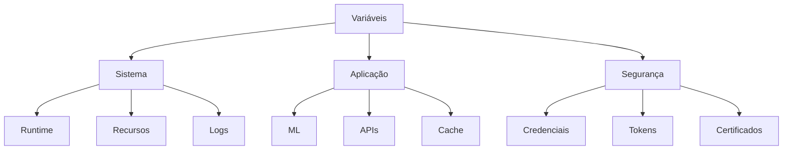

# Variáveis de Ambiente

## 1. Visão Geral

### 1.1 Propósito
Este documento define todas as variáveis de ambiente necessárias para a configuração e operação do sistema Big Brother CNN.

### 1.2 Escopo


## 2. Variáveis do Sistema

### 2.1 Runtime
```python
class SystemEnv:
    def __init__(self):
        self.variables = {
            "RUNTIME": {
                "BB_ENV": {
                    "description": "Ambiente de execução",
                    "values": ["development", "staging", "production"],
                    "default": "development"
                },
                "BB_DEBUG": {
                    "description": "Modo debug",
                    "values": ["0", "1"],
                    "default": "0"
                },
                "BB_LOG_LEVEL": {
                    "description": "Nível de log",
                    "values": ["DEBUG", "INFO", "WARN", "ERROR"],
                    "default": "INFO"
                }
            }
        }
```

### 2.2 Recursos
```yaml
resource_env:
  BB_CPU_LIMIT:
    description: "Limite de CPU por processo"
    value: "4"
    unit: "cores"
    
  BB_MEM_LIMIT:
    description: "Limite de memória por processo"
    value: "8"
    unit: "GB"
    
  BB_GPU_MEMORY:
    description: "Memória GPU reservada"
    value: "8"
    unit: "GB"
```

## 3. Variáveis da Aplicação

### 3.1 Machine Learning
```json
{
    "ml_env": {
        "BB_MODEL_PATH": {
            "description": "Caminho dos modelos",
            "value": "/opt/bigbrother/models",
            "required": true
        },
        "BB_BATCH_SIZE": {
            "description": "Tamanho do batch para inferência",
            "value": "32",
            "type": "integer"
        },
        "BB_INFERENCE_TIMEOUT": {
            "description": "Timeout para inferência",
            "value": "1000",
            "unit": "ms"
        }
    }
}
```

### 3.2 APIs e Serviços
```yaml
api_env:
  BB_API_PORT:
    description: "Porta da API REST"
    value: "8080"
    type: "integer"
    
  BB_GRPC_PORT:
    description: "Porta gRPC"
    value: "50051"
    type: "integer"
    
  BB_MAX_CONNECTIONS:
    description: "Máximo de conexões"
    value: "1000"
    type: "integer"
```

## 4. Variáveis de Segurança

### 4.1 Autenticação
```python
class SecurityEnv:
    def __init__(self):
        self.variables = {
            "auth": {
                "BB_JWT_SECRET": {
                    "description": "Chave para JWT",
                    "required": True,
                    "secret": True
                },
                "BB_JWT_EXPIRATION": {
                    "description": "Tempo de expiração JWT",
                    "value": "3600",
                    "unit": "seconds"
                },
                "BB_API_KEY": {
                    "description": "API Key para serviços",
                    "required": True,
                    "secret": True
                }
            }
        }
```

### 4.2 Certificados
```yaml
cert_env:
  BB_SSL_CERT:
    description: "Caminho do certificado SSL"
    value: "/etc/bigbrother/ssl/cert.pem"
    required: true
    
  BB_SSL_KEY:
    description: "Caminho da chave privada SSL"
    value: "/etc/bigbrother/ssl/key.pem"
    required: true
    secret: true
```

## 5. Variáveis de Banco de Dados

### 5.1 Conexão Principal
```json
{
    "db_env": {
        "BB_DB_HOST": {
            "description": "Host do banco de dados",
            "value": "localhost",
            "required": true
        },
        "BB_DB_PORT": {
            "description": "Porta do banco de dados",
            "value": "5432",
            "type": "integer"
        },
        "BB_DB_NAME": {
            "description": "Nome do banco de dados",
            "value": "bigbrother",
            "required": true
        },
        "BB_DB_USER": {
            "description": "Usuário do banco",
            "required": true,
            "secret": true
        },
        "BB_DB_PASSWORD": {
            "description": "Senha do banco",
            "required": true,
            "secret": true
        }
    }
}
```

### 5.2 Cache
```yaml
cache_env:
  BB_REDIS_HOST:
    description: "Host do Redis"
    value: "localhost"
    required: true
    
  BB_REDIS_PORT:
    description: "Porta do Redis"
    value: "6379"
    type: "integer"
    
  BB_REDIS_DB:
    description: "Número do banco Redis"
    value: "0"
    type: "integer"
```

## 6. Variáveis de Monitoramento

### 6.1 Métricas
```python
class MonitoringEnv:
    def __init__(self):
        self.variables = {
            "metrics": {
                "BB_PROMETHEUS_PORT": {
                    "description": "Porta Prometheus",
                    "value": "9090",
                    "type": "integer"
                },
                "BB_GRAFANA_PORT": {
                    "description": "Porta Grafana",
                    "value": "3000",
                    "type": "integer"
                }
            },
            "logging": {
                "BB_LOG_PATH": {
                    "description": "Caminho dos logs",
                    "value": "/var/log/bigbrother",
                    "required": True
                },
                "BB_LOG_FORMAT": {
                    "description": "Formato dos logs",
                    "value": "json",
                    "options": ["json", "text"]
                }
            }
        }
```

### 6.2 Alertas
```yaml
alert_env:
  BB_ALERT_ENDPOINT:
    description: "Endpoint para alertas"
    value: "http://alert-manager:9093"
    required: true
    
  BB_ALERT_CHANNEL:
    description: "Canal padrão de alertas"
    value: "#ops-alerts"
    
  BB_ALERT_TIMEOUT:
    description: "Timeout para alertas"
    value: "30"
    unit: "seconds"
```

## 7. Variáveis de Integração

### 7.1 Serviços Externos
```json
{
    "integration_env": {
        "BB_HR_API_URL": {
            "description": "URL da API do RH",
            "required": true,
            "format": "url"
        },
        "BB_HR_API_KEY": {
            "description": "API Key do RH",
            "required": true,
            "secret": true
        },
        "BB_NOTIFICATION_URL": {
            "description": "URL do serviço de notificação",
            "required": true,
            "format": "url"
        }
    }
}
```

### 7.2 Webhooks
```yaml
webhook_env:
  BB_WEBHOOK_SECRET:
    description: "Segredo para webhooks"
    required: true
    secret: true
    
  BB_WEBHOOK_TIMEOUT:
    description: "Timeout para webhooks"
    value: "5"
    unit: "seconds"
    
  BB_WEBHOOK_RETRY:
    description: "Tentativas de retry"
    value: "3"
    type: "integer"
```

## 8. Variáveis de Feature Flags

### 8.1 Features
```python
class FeatureEnv:
    def __init__(self):
        self.variables = {
            "features": {
                "BB_FEATURE_FACE": {
                    "description": "Face recognition",
                    "value": "1",
                    "type": "boolean"
                },
                "BB_FEATURE_ATTRIBUTE": {
                    "description": "Attribute analysis",
                    "value": "1",
                    "type": "boolean"
                },
                "BB_FEATURE_PATTERN": {
                    "description": "Pattern analysis",
                    "value": "1",
                    "type": "boolean"
                }
            }
        }
```

### 8.2 Experimentos
```yaml
experiment_env:
  BB_EXP_NEW_MODEL:
    description: "Novo modelo ML"
    value: "0"
    type: "boolean"
    
  BB_EXP_BATCH_INFERENCE:
    description: "Inferência em batch"
    value: "0"
    type: "boolean"
```

## 9. Variáveis de Deploy

### 9.1 Kubernetes
```json
{
    "k8s_env": {
        "BB_K8S_NAMESPACE": {
            "description": "Namespace Kubernetes",
            "value": "bigbrother",
            "required": true
        },
        "BB_K8S_REPLICAS": {
            "description": "Número de réplicas",
            "value": "3",
            "type": "integer"
        },
        "BB_K8S_CPU_REQUEST": {
            "description": "CPU request",
            "value": "2",
            "unit": "cores"
        }
    }
}
```

### 9.2 Docker
```yaml
docker_env:
  BB_DOCKER_REGISTRY:
    description: "Registry Docker"
    value: "registry.company.com"
    required: true
    
  BB_DOCKER_TAG:
    description: "Tag da imagem"
    value: "latest"
    
  BB_DOCKER_PULL_SECRET:
    description: "Secret para pull"
    required: true
    secret: true
```

## 10. Exemplos de Uso

### 10.1 Development
```bash
# Sistema
export BB_ENV=development
export BB_DEBUG=1
export BB_LOG_LEVEL=DEBUG

# ML
export BB_MODEL_PATH=/models
export BB_BATCH_SIZE=16

# Database
export BB_DB_HOST=localhost
export BB_DB_NAME=bigbrother_dev
```

### 10.2 Production
```bash
# Sistema
export BB_ENV=production
export BB_DEBUG=0
export BB_LOG_LEVEL=INFO

# Recursos
export BB_CPU_LIMIT=8
export BB_MEM_LIMIT=16

# Segurança
export BB_JWT_SECRET=<secret>
export BB_API_KEY=<key>
``` 