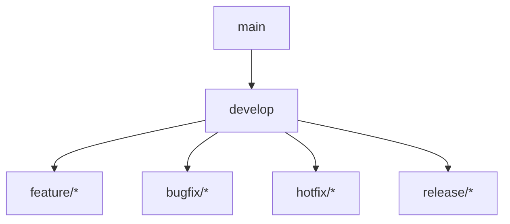
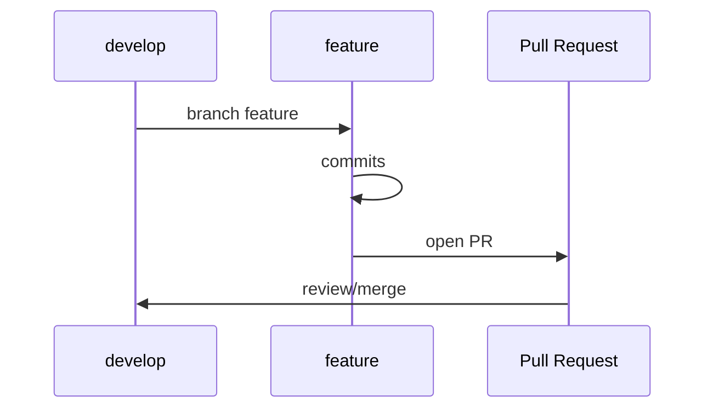
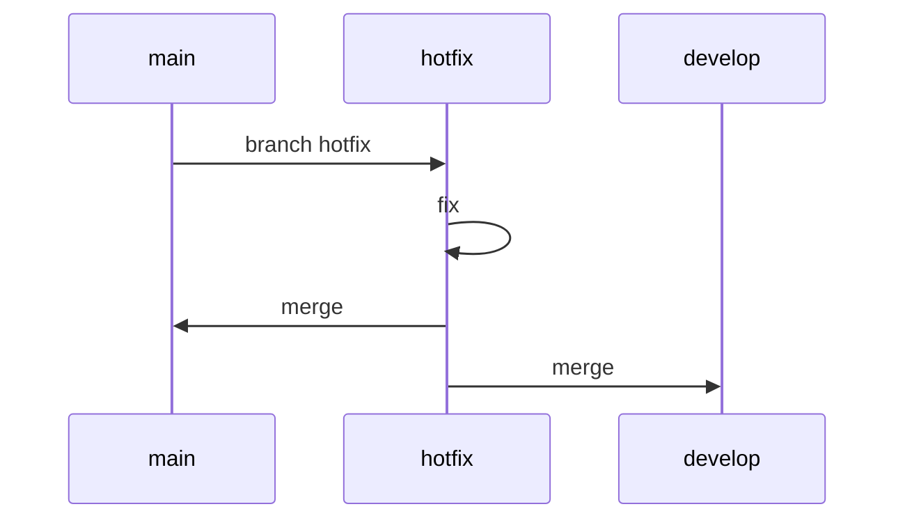
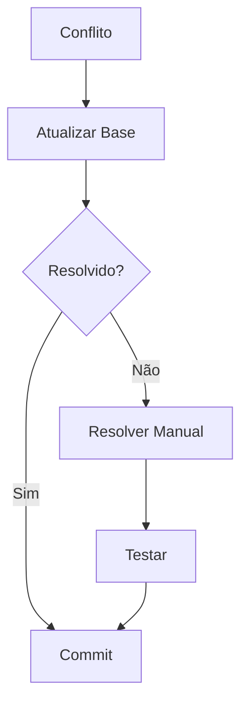

# Guia de Branches

## 1. Estrutura de Branches

### 1.1 Branches Principais


### 1.2 Descrição
| Branch | Descrição | Base | Merge Para |
|--------|-----------|------|------------|
| main | Produção | - | - |
| develop | Desenvolvimento | main | main |
| feature/* | Features | develop | develop |
| bugfix/* | Correções | develop | develop |
| hotfix/* | Emergencial | main | main/develop |
| release/* | Release | develop | main/develop |

## 2. Nomenclatura

### 2.1 Padrões
```python
class BranchNaming:
    def __init__(self):
        self.patterns = {
            "feature": {
                "prefix": "feature/",
                "format": "feature/BB-{ticket}-{description}",
                "example": "feature/BB-123-face-recognition"
            },
            "bugfix": {
                "prefix": "bugfix/",
                "format": "bugfix/BB-{ticket}-{description}",
                "example": "bugfix/BB-456-memory-leak"
            },
            "hotfix": {
                "prefix": "hotfix/",
                "format": "hotfix/BB-{ticket}-{description}",
                "example": "hotfix/BB-789-critical-error"
            },
            "release": {
                "prefix": "release/",
                "format": "release/v{major}.{minor}.{patch}",
                "example": "release/v1.2.0"
            }
        }
```

### 2.2 Regras
```yaml
naming_rules:
  general:
    - lowercase apenas
    - usar hífens para espaços
    - prefixo obrigatório
    - ID do ticket obrigatório
    
  description:
    - curto e descritivo
    - máximo 50 caracteres
    - sem caracteres especiais
    - em inglês
    
  version:
    - seguir semver
    - v{major}.{minor}.{patch}
    - prefixo 'v' obrigatório
```

## 3. Fluxo de Trabalho

### 3.1 Feature Branch


### 3.2 Hotfix Branch


## 4. Comandos Git

### 4.1 Criação
```bash
# Feature branch
git checkout develop
git pull origin develop
git checkout -b feature/BB-123-face-recognition

# Hotfix branch
git checkout main
git pull origin main
git checkout -b hotfix/BB-789-critical-error

# Release branch
git checkout develop
git pull origin develop
git checkout -b release/v1.2.0
```

### 4.2 Atualização
```bash
# Atualizar com base
git checkout develop
git pull origin develop
git checkout feature/BB-123-face-recognition
git rebase develop

# Merge feature
git checkout develop
git merge --no-ff feature/BB-123-face-recognition
git push origin develop
```

## 5. Proteções

### 5.1 Branch Protection
```json
{
    "protection_rules": {
        "main": {
            "require_review": true,
            "required_approvals": 2,
            "dismiss_stale_reviews": true,
            "require_status_checks": true,
            "restrict_pushes": true
        },
        "develop": {
            "require_review": true,
            "required_approvals": 1,
            "dismiss_stale_reviews": true,
            "require_status_checks": true,
            "restrict_pushes": false
        }
    }
}
```

### 5.2 Status Checks
```yaml
required_checks:
  - build
  - tests
  - linting
  - security
  - coverage
```

## 6. Manutenção

### 6.1 Limpeza
```python
class BranchMaintenance:
    def __init__(self):
        self.cleanup_rules = {
            "merged_branches": {
                "age": "2 weeks",
                "types": ["feature", "bugfix"],
                "exclude": ["main", "develop"]
            },
            "stale_branches": {
                "inactive": "1 month",
                "types": ["feature", "bugfix"],
                "action": "notify"
            },
            "release_branches": {
                "keep_last": 5,
                "age": "3 months",
                "action": "archive"
            }
        }
```

### 6.2 Comandos
```bash
# Listar branches merged
git branch --merged develop

# Deletar branches merged
git branch --merged develop | grep -v "^\*\|main\|develop" | xargs git branch -d

# Listar branches remotas
git remote prune origin --dry-run
```

## 7. Integração Contínua

### 7.1 Workflows
```yaml
branch_workflows:
  feature:
    - trigger: push
      actions:
        - lint
        - build
        - test
    
    - trigger: pull_request
      actions:
        - lint
        - build
        - test
        - security
        - review
        
  release:
    - trigger: create
      actions:
        - version
        - changelog
        - build
        - test
        - deploy-staging
```

### 7.2 Automação
```json
{
    "automation": {
        "version_bump": {
            "trigger": "release/*",
            "files": [
                "package.json",
                "VERSION"
            ],
            "commit": true
        },
        "changelog": {
            "trigger": "release/*",
            "template": "conventional",
            "sections": [
                "Features",
                "Fixes",
                "Breaking Changes"
            ]
        }
    }
}
```

## 8. Boas Práticas

### 8.1 Commits
```yaml
commit_guidelines:
  message:
    - prefixo de tipo
    - descrição clara
    - referência ticket
    - máximo 72 caracteres
    
  types:
    - feat: nova feature
    - fix: correção bug
    - docs: documentação
    - style: formatação
    - refactor: refatoração
    - test: testes
    - chore: manutenção
```

### 8.2 Pull Requests
```python
class PRGuidelines:
    def __init__(self):
        self.guidelines = {
            "title": {
                "format": "[BB-{ticket}] {type}: {description}",
                "max_length": 72
            },
            "description": {
                "sections": [
                    "Objetivo",
                    "Mudanças",
                    "Testes",
                    "Screenshots"
                ],
                "required": ["Objetivo", "Mudanças"]
            },
            "review": {
                "required_approvals": 1,
                "consider": [
                    "código limpo",
                    "testes adequados",
                    "documentação",
                    "performance"
                ]
            }
        }
```

## 9. Resolução de Conflitos

### 9.1 Estratégias


### 9.2 Procedimentos
1. Atualizar branch base
2. Rebase branch atual
3. Resolver conflitos
4. Testar mudanças
5. Commit resolução
6. Push branch

## 10. Exemplos

### 10.1 Feature Branch
```bash
# Criar feature
git checkout develop
git pull origin develop
git checkout -b feature/BB-123-face-recognition

# Desenvolvimento
git add .
git commit -m "feat: implement face recognition"
git push origin feature/BB-123-face-recognition

# Pull Request
git checkout develop
git pull origin develop
git merge --no-ff feature/BB-123-face-recognition
git push origin develop
```

### 10.2 Release Branch
```bash
# Criar release
git checkout develop
git pull origin develop
git checkout -b release/v1.2.0

# Preparação
bump_version 1.2.0
generate_changelog
git commit -am "chore: release v1.2.0"

# Finalização
git checkout main
git merge --no-ff release/v1.2.0
git tag -a v1.2.0 -m "Version 1.2.0"
git push origin main --tags
``` 