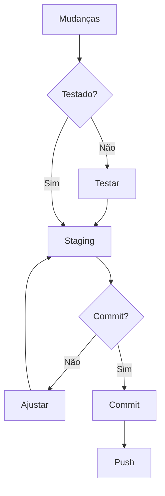

# Guia de Commits

## 1. Estrutura da Mensagem

### 1.1 Formato
```
<tipo>(<escopo>): <descrição>

[corpo]

[rodapé]
```

### 1.2 Componentes
```python
class CommitStructure:
    def __init__(self):
        self.components = {
            "tipo": {
                "obrigatório": True,
                "formato": "lowercase",
                "tipos_válidos": [
                    "feat",
                    "fix",
                    "docs",
                    "style",
                    "refactor",
                    "test",
                    "chore"
                ]
            },
            "escopo": {
                "obrigatório": False,
                "formato": "lowercase",
                "exemplos": [
                    "face",
                    "attribute",
                    "badge",
                    "schedule",
                    "pattern"
                ]
            },
            "descrição": {
                "obrigatório": True,
                "max_length": 50,
                "formato": "imperative mood"
            },
            "corpo": {
                "obrigatório": False,
                "max_length": 72,
                "formato": "markdown"
            },
            "rodapé": {
                "obrigatório": False,
                "formato": "key: value",
                "tipos": [
                    "BREAKING CHANGE",
                    "Closes",
                    "See also"
                ]
            }
        }
```

## 2. Tipos de Commit

### 2.1 Definições
```json
{
    "tipos": {
        "feat": {
            "descrição": "Nova funcionalidade",
            "exemplo": "feat(face): add liveness detection",
            "quando_usar": "Novas features para usuários"
        },
        "fix": {
            "descrição": "Correção de bug",
            "exemplo": "fix(attribute): resolve memory leak",
            "quando_usar": "Correções de bugs para usuários"
        },
        "docs": {
            "descrição": "Documentação",
            "exemplo": "docs(api): update authentication docs",
            "quando_usar": "Mudanças apenas em documentação"
        },
        "style": {
            "descrição": "Formatação",
            "exemplo": "style(core): format according to black",
            "quando_usar": "Mudanças que não afetam código"
        },
        "refactor": {
            "descrição": "Refatoração",
            "exemplo": "refactor(pattern): simplify detection logic",
            "quando_usar": "Mudança de código que não corrige ou adiciona"
        },
        "test": {
            "descrição": "Testes",
            "exemplo": "test(badge): add OCR validation tests",
            "quando_usar": "Adição ou modificação de testes"
        },
        "chore": {
            "descrição": "Manutenção",
            "exemplo": "chore(deps): update dependencies",
            "quando_usar": "Mudanças no processo de build ou ferramentas"
        }
    }
}
```

### 2.2 Exemplos
```yaml
exemplos:
  feat:
    - "feat(face): implement face detection"
    - "feat(auth): add 2FA support"
    - "feat(api): add new endpoint for analysis"
    
  fix:
    - "fix(memory): resolve GPU memory leak"
    - "fix(perf): optimize image processing"
    - "fix(api): handle timeout errors"
    
  docs:
    - "docs(api): update swagger documentation"
    - "docs(setup): add installation guide"
    - "docs(ml): explain model parameters"
```

## 3. Boas Práticas

### 3.1 Regras Gerais
```python
class CommitGuidelines:
    def __init__(self):
        self.rules = {
            "mensagem": {
                "do": [
                    "Usar modo imperativo",
                    "Primeira letra maiúscula",
                    "Sem ponto final",
                    "Ser conciso e claro"
                ],
                "dont": [
                    "Usar tempo passado",
                    "Ser vago ou genérico",
                    "Ultrapassar limite de caracteres",
                    "Misturar idiomas"
                ]
            },
            "conteúdo": {
                "do": [
                    "Commit atômico",
                    "Agrupar mudanças relacionadas",
                    "Testar antes do commit",
                    "Revisar alterações"
                ],
                "dont": [
                    "Misturar mudanças não relacionadas",
                    "Commitar código quebrado",
                    "Incluir arquivos temporários",
                    "Fazer commit sem testar"
                ]
            }
        }
```

### 3.2 Recomendações
```yaml
recomendações:
  escrita:
    - use voz ativa
    - seja específico
    - referencie tickets
    - mantenha consistência
    
  organização:
    - commits pequenos
    - mudanças lógicas
    - ordem cronológica
    - mensagens claras
    
  workflow:
    - commit frequente
    - teste antes
    - revise mudanças
    - mantenha padrão
```

## 4. Breaking Changes

### 4.1 Formato
```json
{
    "breaking_change": {
        "formato": {
            "tipo": "feat|fix",
            "indicador": "!",
            "rodapé": "BREAKING CHANGE: descrição"
        },
        "exemplo": {
            "título": "feat(api)!: change authentication flow",
            "corpo": "Change JWT token format",
            "rodapé": "BREAKING CHANGE: new token format incompatible"
        }
    }
}
```

### 4.2 Exemplos
```bash
# Breaking change em feature
feat(auth)!: change authentication method

Implement OAuth2 authentication

BREAKING CHANGE: removes basic auth support

# Breaking change em fix
fix(api)!: change response format

Standardize API responses

BREAKING CHANGE: response now always includes metadata
```

## 5. Integração com Issues

### 5.1 Referências
```python
class IssueReferences:
    def __init__(self):
        self.patterns = {
            "closes": {
                "formato": "Closes #123",
                "quando_usar": "Resolve completamente",
                "exemplo": "feat(face): add detection\n\nCloses #123"
            },
            "refs": {
                "formato": "Refs #123",
                "quando_usar": "Relacionado parcialmente",
                "exemplo": "feat(face): start detection\n\nRefs #123"
            },
            "multiple": {
                "formato": "Closes #123, #124",
                "quando_usar": "Resolve múltiplas",
                "exemplo": "fix(core): major update\n\nCloses #123, #124"
            }
        }
```

### 5.2 Exemplos
```yaml
issue_examples:
  single:
    - "feat(auth): add login\n\nCloses #123"
    - "fix(api): handle errors\n\nRefs #456"
    
  multiple:
    - "feat(core): major update\n\nCloses #123, #124"
    - "fix(docs): update guides\n\nRefs #456, #457"
    
  partial:
    - "feat(ui): start redesign\n\nRefs #789"
    - "fix(perf): optimize part 1\n\nRefs #101"
```

## 6. Ferramentas

### 6.1 Git Hooks
```bash
#!/bin/sh
# .git/hooks/commit-msg

commit_msg=$(cat "$1")
pattern='^(feat|fix|docs|style|refactor|test|chore)(\([a-z]+\))?: .{1,50}$'

if ! echo "$commit_msg" | head -1 | grep -qE "$pattern"; then
    echo "Error: Invalid commit message format"
    echo "Format: <type>(<scope>): <description>"
    exit 1
fi
```

### 6.2 Configuração
```yaml
commitlint:
  extends:
    - "@commitlint/config-conventional"
  rules:
    type-enum:
      - 2
      - always
      - - feat
        - fix
        - docs
        - style
        - refactor
        - test
        - chore
    
    scope-case:
      - 2
      - always
      - lower-case
    
    subject-case:
      - 2
      - never
      - - sentence-case
        - start-case
        - pascal-case
        - upper-case
```

## 7. Workflow

### 7.1 Processo


### 7.2 Checklist
```python
class CommitChecklist:
    def __init__(self):
        self.steps = {
            "pre_commit": [
                "Testar mudanças",
                "Revisar código",
                "Verificar formatação",
                "Remover debugs"
            ],
            "commit": [
                "Escolher tipo correto",
                "Definir escopo",
                "Escrever descrição clara",
                "Adicionar corpo se necessário"
            ],
            "post_commit": [
                "Verificar commit",
                "Confirmar push",
                "Atualizar ticket",
                "Notificar time se necessário"
            ]
        }
```

## 8. Exemplos Completos

### 8.1 Feature
```bash
# Nova feature
feat(face): implement real-time face detection

Add support for real-time face detection using OpenCV and
CUDA acceleration. This implementation includes:
- Multi-face detection
- Performance optimization
- Error handling

Performance tests show 30fps processing rate on GPU.

Closes #123
```

### 8.2 Fix
```bash
# Correção de bug
fix(memory): resolve GPU memory leak

Fix memory leak in face detection pipeline by properly
releasing CUDA resources after processing.

Impact:
- Reduces memory usage by 60%
- Improves long-term stability
- Prevents OOM errors

Closes #456
```

## 9. Troubleshooting

### 9.1 Problemas Comuns
```json
{
    "problemas": {
        "formato_inválido": {
            "sintoma": "Erro no commit-hook",
            "causa": "Mensagem não segue padrão",
            "solução": "Ajustar formato conforme guia"
        },
        "commit_grande": {
            "sintoma": "Muitas mudanças",
            "causa": "Commits não atômicos",
            "solução": "Dividir em commits menores"
        },
        "mensagem_vaga": {
            "sintoma": "Falta contexto",
            "causa": "Descrição inadequada",
            "solução": "Adicionar detalhes relevantes"
        }
    }
}
```

### 9.2 Soluções
```yaml
soluções:
  formato:
    - usar ferramenta commitlint
    - seguir template
    - revisar antes
    
  tamanho:
    - dividir mudanças
    - commits atômicos
    - manter foco
    
  clareza:
    - ser específico
    - adicionar contexto
    - explicar impacto
```

## 10. Referências

### 10.1 Documentação
- [Conventional Commits](https://www.conventionalcommits.org/)
- [Angular Commit Guidelines](https://github.com/angular/angular/blob/master/CONTRIBUTING.md#commit)
- [Git Commit Best Practices](https://git-scm.com/book/en/v2/Distributed-Git-Contributing-to-a-Project#_commit_guidelines)

### 10.2 Ferramentas
- commitlint
- husky
- commitizen
- semantic-release 